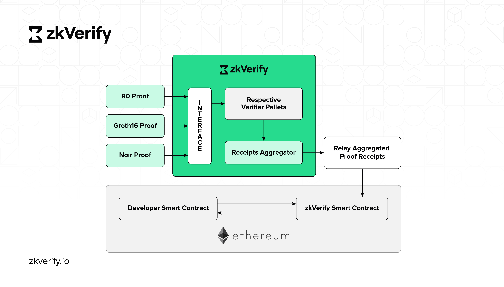

# Core Architecture

## Core Blockchain

Our chain is an L1 proof of stake blockchain built on the Substrate framework. This chain is specialized in zk proofs verification, with built-in verifier pallets, each for a different type of zk proofs. tVFY is the token for our chain, and to verify proofs on our chain you will need tVFY.

## Proof Submission Interface

This is the entry point for our blockchain, where users will be submitting transactions and making RPC calls. Similar to any other blockchain we have our SDK implementation called [zkVerifyJS](https://docs.zkverify.io/tutorials/submit-proofs/typescript-example) that you can use to interact with the chain. This library makes it very easy for developers to interact with the blockchain with simple code snippets to register a verification key, submit a zk proof, listen to events, get aggregation details, etc.

## Proof Receipt Mechanism

After the proof verification requests are fulfilled by our chain and added to its block, it passes through the aggregation mechanism to generate a proof receipt for the verified proof. These proof receipts are the Merkle root of all the verified proofs for a given batch. These proof receipts are published on a smart contract on a given destination chain (e.g. Ethereum) through relayers.

## Aggregation Engine

The aggregation proofs system is designed to be permissionless and everyone can participate in this step by publishing the aggregation and get some fee by doing this job. It's possible to define several aggregation domains and each domain has its own aggregation size: when a user needs to verify a proof can choose in which domain his proof should be aggregated.

## On Chain Verification

Users submits a Merkle Proof to the zkVerify contract on-chain in order to verify that their proof was indeed verified in the zkVerify Blockchain. Currently, our contracts are deployed on the following chains:

- Sepolia Testnet
- Base Sepolia Testnet
- Arbitrum Sepolia Testnet
- Optimism Sepolia Testnet
- EDU Chain Testnet

## Verifier Pallets

We have created built-in verifier pallets for different proving schemes to support a wide variety of zk proofs on our chain. The proof submission interface passes the proof verification requests to respective verifier pallets which verify these proofs and add them to the block. Currently, we support :

- Groth16 (Circom, SnarkJS, Gnark)
- UltraHonk (Noir)
- UltraPlonk (Noir)
- Risc Zero
- SxT Proof of SQL
- Plonky2
