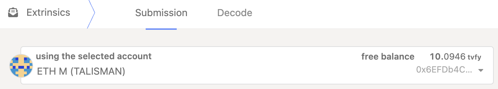
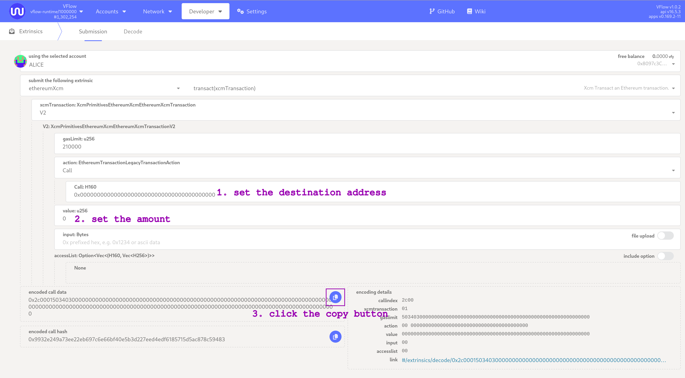

This guide provides step-by-step instructions to teleport tokens across zkVerify Parachains. Before you begin, please [ensure you have a wallet setup correctly and ready to interact with Polkadot-JS](docs/overview/02-getting-started/01-connect-a-wallet.md). 

## XCM Teleport

A **teleport** is a powerful Cross-Consensus Message (XCM) instruction that facilitates the movement of assets between zkVerify Relay Chain and its System Parachains.

A teleport of an asset (VFY token) is an operation performed in two stages by an XCM executor: one part is executed on the Relay chain (burns the asset) and the other part on the Parachain (minting of the asset).


[Image Source](https://wiki.polkadot.network/learn/learn-xcm-usecases/)

In this guide, we will be using teleport to move VFY tokens from zkVerify (Substrate-based) to VFlow (EVM-compatbile) and vice versa.

You can find more information on XCM [here](https://polkadot.com/blog/xcm-the-cross-consensus-message-format/).

### From zkVerify to VFlow via PolkadotJS-UI

From PolkadotJS navigate to `Developer-> Extrinsics` and select the `xcmPallet` pallet and the `teleportAssets` extrinsic:


You can see that we need to supply 4 parameters: `dest`, `beneficiary`, `assets` and `feeAssetItem`.
You can either use the `Quick Teleport Guide` or follow starting from the `Destination` section.

#### Quick Teleport Guide

Go to `Developer -> Extrinsics -> Decode` and copy/paste the following hex:

`0x8c0105000100040500010300000000000000000000000000000000000000000005040000000000000000`

Then from `Decode` move to `Submission`

You need to change the following parameters:

- `beneficiary -> V5 -> X1 -> AccountKey20 -> key: [u8, 20]`: with the EVM address of the receiver on VFlow
- `assets -> V5 -> 0 -> id -> fun -> Fungible: Compact<u128>`: with the amount of VFY tokens you want to teleport to VFlow (specified with 18 digits)

Click on `Submit Transaction` and then `Sign and Submit` on the new window that will appear to conclude the teleport.

#### Destination


This parameter specifies the target chain where the assets are being teleported. Let's select:

- For `dest: XcmVersionedLocation` select `V5` from the drop-down menu. New fields will pop-up. Let's set:
    - For `parents` input `0`
    - For `interior` select `X1` from the drop-down menu. Then new fields will appear. Let's set:
        - For `0` select `Parachain` from the drop-down menu
        - We need finally to insert the ID of the VFlow `Parachain`, which is `1`.

#### Beneficiary


This specifies the account that will receive the assets on the destination chain. Let's set:

- For `beneficiary: XcmVersionedLocation` select `V5` from the drop-down menu. New fields will pop-up. Let's set:
    - For `parents` input `0`
    - For `interior` input `X1` from the drop-down menu. Then new fields will appear. Let's set:
        - For `0` select `AccountKey20` from the drop-down menu
        - For `key` input the address of the Ethereum account you want to receive the assets on VFlow. 

#### Assets


This defines the actual asset(s) and the amount(s) you are sending. Let's set:

- For `assets: XcmVersionedAssets` select `V5` from the drop-down menu. Click on the `Add Item` button. New fields will pop-up. Let's set:
    - For `parents` input `0`
    - For `interior` select  `Here` from the drop-down menu. Then new fields will appear. Let's set:
        - For `fun` select `Fungible` from the drop-down menu
        - For `Fungible` input the amount of assets you want to send.
        - Note: on-chain, amounts use 18 decimals. So if you want 1 VFY, you need to input 1 * 10^18 = `1000000000000000000`.
          - Example:
            - 1 VFY → `1000000000000000000`
            - 0.5 VFY → `500000000000000000`

#### Fee Asset Item

This is simply the index of the asset in the `assets` array that will be used to pay for the XCM teleport fee. We only have a single asset (VFY) and we are using that one, so we set it to `0`.

#### Submitting the Extrinsic

Click on `Submit Transaction` and then `Sign and Submit` on the new window that will appear to conclude the teleport.

### From VFlow to zkVerify via PolkadotJS-UI

**Note:** if you want to bridge tokens back that you previously sent to an address living in Metamask, you must first export your private key from Metamask. You will then need to import this key into a wallet with full EVM and Substrate support, such as SubWallet (or Talisman).

To setup a SubWallet or Talisman wallet please refer to the [documentation to setup a wallet ready to interact with Polkadot-JS](docs/overview/02-getting-started/01-connect-a-wallet.md). 

---

The process here is exactly a mirror of what we did on zkVerify side.

The first thing you must do, is to connect to the VFlow parachain. Supposed you're already connected to zkVerify, click on the zkVerify logo top left of the screen, scroll down and find `VFlow`, then click on it, scroll up again and click `Switch` to connect. 

In the case multiple EVM accounts are detected, you can select the beneficiary by clicking on the current selected account `0x...` (under `free balance`), and choose from the drop-down menu. 



Now that you're connected, from PolkadotJS navigate to `Developer-> Extrinsics` and select the `zkvXcm` pallet and the `teleportAssets` extrinsic.


Like before we need to supply 4 parameters: `dest`, `beneficiary`, `assets` and `feeAssetItem`.
You can either use the `Quick Teleport Guide` or follow starting from the `Destination` section.


#### Quick Teleport Guide

Go to `Developer -> Extrinsics -> Decode` and copy/paste the following hex:

`0x1f010501000500010100486b90dbf0cb9bfe92b6ba7d4942019a17ada772ab5fa9258ac3df821daca54d050401000013000064a7b3b6e00d00000000`

You need to change the following parameters:

- `beneficiary -> V5 -> X1 -> AccountId32 -> id: [u8, 32]`: with the address of the receiver on zkVerify
- `assets -> V5 -> 0 -> id -> fun -> Fungible: Compact<u128>`: with the amount of VFY tokens you want to teleport to zkVerify (specified with 18 digits)

Click on `Submit Transaction` and then `Sign and Submit` on the new window that will appear to conclude the teleport. 

#### Destination

Let's start with the `dest` parameter:


- For `dest: XcmVersionedLocation` select `V5` from the drop-down menu. New fields will pop-up. Let's set:
    - For `parents` input `1`
    - For `interior` select `Here` from the drop-down menu. Then new fields will appear. Let's set:

#### Beneficiary

Let's set the `beneficiary` parameter as follows:


- For `beneficiary: XcmVersionedLocation` select `V5` from the drop-down menu. New fields will pop-up. Let's set:
    - For `parents` input `0`
    - For `interior` select `X1` from the drop-down menu. Then new fields will appear. Let's set:
        - For `0` select `AccountId32` from the drop-down menu
        - For `id` input the address of the zkVerify account you want to receive the assets on zkVerify.

#### Assets

Let's set the `assets` parameter as follows:


- For `assets: XcmVersionedAssets` select `V5` from the drop-down menu. Click on the `Add Item` button. New fields will pop-up. Let's set:
    - For `parents` input `1`
    - For `interior` select `Here` from the drop-down menu. Then new fields will appear. Let's set:
        - For `fun` select `Fungible` from the drop-down menu
        - For `fun` input the amount of assets you want to send. e.g. to send 1 VFY , remembering that the token has 18 decimals, it's: `1000000000000000000`.

#### Fee Asset Item

This is simply the index of the asset in the `assets` array that will be used to pay for the XCM teleport fee. We only have a single asset (VFY) and we are using that one, so we set it to `0`.

#### Submitting the extrinsic

Click on `Submit Transaction` and then `Sign and Submit` on the new window that will appear to conclude our teleport.

### From VFlow to zkVerify via EVM Tooling

We've included a precompile contract in VFlow that allows you to teleport VFY tokens to zkVerify directly from your standard EVM tools (like Metamask).
Contract is deployed at address `2060`. Here is an example script leveraging `web3` library:

```javascript
const { Web3 } = require('web3');

// Configuration
const RPC_URL = 'wss://vflow-volta-rpc.zkverify.io'; // VFlow RPC endpoint
const PRIVATE_KEY = ''; // Your Ethereum account private key
const PRECOMPILE_ADDRESS = '0x000000000000000000000000000000000000080C'; // XCM Teleport precompile address

// XCM Teleport precompile ABI
const teleportABI = [
  {
    name: 'teleportToRelayChain',
    type: 'function',
    inputs: [
      { name: 'destinationAccount', type: 'bytes32' },
      { name: 'amount', type: 'uint256' },
    ],
    outputs: [],
    stateMutability: 'nonpayable',
  },
];

async function testTeleport() {
  // Initialize Web3
  const web3 = new Web3(RPC_URL);

  // Add your account to the wallet
  const account = web3.eth.accounts.privateKeyToAccount(PRIVATE_KEY);
  web3.eth.accounts.wallet.add(account);

  console.log(`Using account: ${account.address}`);

  // Check balance
  const balance = await web3.eth.getBalance(account.address);
  console.log(`Account balance: ${web3.utils.fromWei(balance, 'ether')} tVFY`);

  // Set up the contract
  const contract = new web3.eth.Contract(teleportABI, PRECOMPILE_ADDRESS);

  // Test parameters
  const destinationAccount = ''; // 32-byte relay chain account
  const amount = web3.utils.toWei('1', 'ether'); // 1 VFY

  console.log(`Teleporting ${web3.utils.fromWei(amount, 'ether')} VFY`);
  console.log(`From: ${account.address} (parachain)`);
  console.log(`To: ${destinationAccount} (relay chain)`);

  // Estimate gas
  const gasEstimate = await contract.methods
    .teleportToRelayChain(destinationAccount, amount)
    .estimateGas({ from: account.address });

  console.log(`Estimated gas: ${gasEstimate}`);

  // Send transaction
  console.log('Sending transaction...');
  const result = await contract.methods
    .teleportToRelayChain(destinationAccount, amount)
    .send({
      from: account.address,
      gas: gasEstimate,
    });

  console.log('✅ Transaction successful!');
  console.log(`Transaction hash: ${result.transactionHash}`);
  console.log(`Block number: ${result.blockNumber}`);
  console.log(`Gas used: ${result.gasUsed}`);
}

testTeleport();

```

A couple of important notes:
- In this case, the `amount` to be sent, doesn't require to specify 18 decimals.
- The `destinationAccount` is an hex public key of zkVerify. While from PolkadotJS-UI you can use the AccountID and PolkadotJS automatically performs the conversion to the correct format, in this case you need to do it manually.
From PolkadotJS navigate to `Developer-> Utilities` and select the `Convert Address` tab:


Just copy paste the account id in the `address to convert` field to automatically get the public key to use as `destinationAccount`.

### Teleport via zkv-xcm-library
We've developed a Typescript library, called [zkv-xcm-library](https://github.com/zkVerify/zkv-xcm-library?tab=readme-ov-file#zkverify-xcm-library), in order to simplify the creation of such XCM teleport extrinsics and for ease of integration with your app/frontend.
Check the readme for installation and usage instructions.

### A Note on XCM Teleport Fees

Since an XCM message is executed both on the Relay Chain and Parachain side, both sender and receiver need to pay for execution fees. However:
- The fees charged to the sender **are deducted directly from its main balance**. This happens immediately when the transaction is included in a block, **before the teleport's burn logic is even executed**. So, if after fee deduction your remaining balance is not enough to cover the burn logic, the transaction will fail.
- The fees charged to the receiver **are deducted from the amount being teleported**. This happens when the XCM message is executed on the Parachain side.

### Deep-Dive: XCM Parameters Explanation

Let's provide a brief explanation here of the complex XCM message construction and parameters we've seen before:
- `dest` provides details about the destination of the message (we need to select the XCM version currently being used. V5 is the most-up-to-date at the time of writing).
    - `parents` tells the XCM executor that the following `interior` is relative to the chain itself. 

    - `interior` describes the rest of the path, the specific, step-by-step directions to the final destination. It defines a sequence of "hops" or _Junctions_. Each junction is a specific location or entity within a consensus system.
        - The interior is structured as a container, usually X1, X2, X3, etc. where X stands for the number of Junctions (hops) in the path.
            - Here: Equivalent to X0, no junctions.
            - X1: A path with one junction.
            - X2: A path with two junctions.
            - ...and so on, up to X8.

You could think of it like a File System where: 
- The root directory is the Relay Chain
- There are as many sub-directories as Parachains.
- In each directory there is a list of consensus entities (accounts, pallets, etc.) living in that Relay Chain/Parachain.


So setting `parents = 0` means it's the current location (in bash it would be `.`) while `parents = 1` means it's the parent location (in bash it would be `..`).

Setting `interior = X1 { Parachain: 3 }` means essentially specifying `./parachain_3`;
Instead setting `interior = X2 { Parachain: 3, AccountKey20: 0x111 }` means essentially specifying `./parachain_3/account_111`

Putting it all together, in this case, we are initiating the teleport from the Relay Chain (so `parents` is 0, since we are already on the Relay Chain) to the Parachain with id `1`, which is *one hop* away from the parent (so `interior` is `X1` with `Parachain` set to `1`).

### Possible Errors and Recovery

In this section we list some known possible user errors, and related recovery opportunities.

#### Teleporting funds to AccountId32 addresses on VFlow

VFlow only supports 20byte addresses, identified by the `AccountKey20` type. It is therefore a mistake, and should *never* be done, to teleport funds to an `AccountId32` address on VFlow. Unfortunately the PolkadotJS UI is generic and does not prevent users from submitting erroneous extrinsics.

Luckily, in case this mistake occurs, it is still possible to recover the funds, having the private key for the destination `AccountId32`. In this paragraph we show how to send the funds teleported to VFlow to another address on VFlow, using an XCM remote execution requested from zkVerify.

To do so, we need to perform a two step operation: first, we create the extrinsic on VFlow to send funds to a given address through the EVM, and second we execute this extrinsic remotely from zkVerify. 

##### Step 1. Create the extrinsic on VFlow

**On the VFlow explorer**, go to `Developer -> Extrinsics -> Decode` and copy/paste the following hex:
`
0x2c0001503403000000000000000000000000000000000000000000000000000000000000000000000000000000000000000000000000000000000000000000000000000000000000000000000000000000000000000000000000
`
Then from `Decode` move to `Submission`. You need to change the following parameters:

- `Call: H160`: with the address of the receiver on VFlow
- `value: u256`: with the amount of VFY tokens you want to send to another VFlow address (specified with 18 digits). **NOTICE**: this cannot be the full balance of the address, because some funds are needed to complete the execution of the XCM extrinsic. For example, if you follow the steps in this document, we reserve 0.1VFY for the execution. This is an overestimation, and the unused part will be reimbursed to the account specified in the next step.

Once you set the parameters correctly, **do not** submit the transaction, but rather click on the UI button to copy the encoded call data.



##### Step 2. Execute remotely from zkVerify

**On the zkVerify explorer**, go to `Developer -> Extrinsics -> Decode` and copy/paste the following hex:

`
0x8c000500010004051400040100001300008a5d78456301130100001300008a5d784563010006010000140d0100000103000000000000000000000000000000000000000000
`

Then from `Decode` move to `Submission`. You need to change the following parameters:

- `message -> Transact -> call: XcmDoubleEncoded`: with the encoded call data that you copied in the previous step
- `message -> DepositAsset -> AccountKey20 -> key: [u8; 20]`: with the address of the receiver of the reimbursement mentioned in the previous step, on VFlow


Click on `Submit Transaction` and then `Sign and Submit` on the new window that will appear to conclude the operation.

