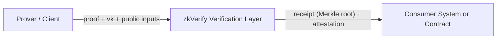

## What it is

When you put ZK into a real system, proof generation and verification rarely happen in the same place. A prover produces the proof, while another system needs to trust and reuse the verification result. zkVerify’s role is to pull “verification” out of application logic and make it a dedicated verification layer.

From a systems perspective, zkVerify is a Substrate-based L1 PoS chain with built-in verifier pallets, each supporting a proof system. It is built to verify proofs, not to turn a general-purpose chain into a verifier. When you submit a verification request, you pay in VFY, which sets the entry point and cost model.

Verification results don’t stop inside zkVerify. They enter the aggregation flow, become a proof receipt (Merkle root), and are published by a relayer to destination-chain contracts for consumption by other systems. This is what makes zkVerify suitable as a “shared source of verified truth” across systems.

## When you need it

If you need an independent, reusable verification layer, zkVerify removes the burden of maintaining verification logic yourself. You submit the proof and required materials, and zkVerify produces the verification result for other systems to consume.

If your verification result must be consumed by on-chain contracts or cross-chain systems, the receipt publishing path becomes a critical part of your architecture. At that point, the key question is not “how do I verify on-chain,” but “how do I obtain and publish the receipt in a trusted way.”

## When you don’t need it

If your product only consumes verification results within a single system and you can control verification logic and cost, you don’t need zkVerify. You can close the loop inside your existing stack.

If you’re still at local verification and prototype stage, don’t rush to integrate zkVerify. First get your proving toolchain stable; integrate zkVerify when you start caring about cross-system trust or on-chain consumption.

## You might ask

Q: Does zkVerify generate proofs for me?
A: No. Proof generation stays in your prover toolchain. zkVerify only verifies.

Q: Why not verify directly in the contract?
A: Direct verification means maintaining verification logic for each proof system. zkVerify centralizes that work and lets other systems reuse results via receipts.

Q: If I don’t need cross-chain or on-chain consumption, should I still use it?
A: Not necessarily. zkVerify’s value is strongest when verification results are reused across multiple systems.

## Example

Here’s a minimal mental model: generation happens outside, verification happens in zkVerify, consumption happens downstream:

## Common pitfall

Symptom: You treat zkVerify like a proving platform and can’t find proof generation APIs. Cause: Confusing “verification layer” with “proof generation.” Fix: Keep prover tooling separate, then hand verification to zkVerify.
