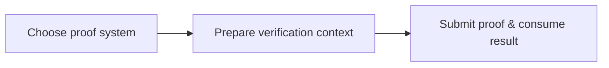

When you start putting zkVerify into a real system, most of the complexity is not “the on-chain verification moment,” but the preparation before integration and the consumption after verification. This page groups that work into three concrete responsibilities so you can see what your project actually needs to own.

## 1. Choose a proof system

zkVerify supports multiple systems, and your choice directly affects proof shape and cost: SNARKs are typically smaller and cheaper to verify, STARKs are larger and more expensive on-chain, and zkVMs are more general but usually have higher prover overhead and larger proofs. This is not “picking a name”; it is choosing your toolchain and long-term cost.

## 2. Prepare the verification context

zkVerify computes a statement hash during verification. It is built from the verifier context, verification key, proof version information, and the hash of public inputs. That means you must prepare vk and public inputs and keep the verification context deterministic and reusable. This context determines how zkVerify decides “which verification domain this proof belongs to.”

## 3. Submit proofs and consume results

The third responsibility is getting users to generate proofs, submitting them to zkVerify, and pulling results back into your system. Proofs come from your prover toolchain; submissions include vk and public inputs. After verification, proofs enter aggregation and form receipts that downstream systems can consume. This is the step that makes your business logic trust the result.

## Where this three-part model applies

When you plan to extract verification from application logic and let multiple systems reuse a single verification result, these three actions are your minimum responsibility boundary. They map to “choose toolchain,” “define verification context,” and “connect results to business logic.”

If your proofs must be consumed by on-chain contracts or cross-chain systems, actions two and three become core engineering work: you must reliably produce the statement hash and obtain receipts that downstream systems can trust.

## Questions worth settling early

Q: What does choosing a proof system affect?
A: Proof size, verification cost, and toolchain complexity. For example, STARKs tend to be larger and more expensive on-chain, while SNARKs are smaller but usually require trusted setup.

Q: What must be inside the verification context?
A: At minimum vk and public inputs, and a deterministic statement hash. zkVerify uses it to identify the verification context of a proof.

Q: Why can’t I skip the third action?
A: zkVerify only verifies. You still need to consume the result and apply business decisions.

## One diagram to keep in mind

This diagram is the minimal mapping of the three responsibilities; later pages expand each step:



Here is a minimal “verification context” sketch. The key is producing the same statement hash as zkVerify:

```text
statement = keccak256(
  keccak256(verifier_ctx),
  hash(vk),
  version_hash(proof),
  keccak256(public_inputs_bytes)
)
```

## A failure pattern to watch for

Symptom: Submitted proofs can’t be reused, or different environments compute different statements. Cause: the verification context is not fixed and vk/public input serialization differs across components. Fix: standardize vk and public input encoding and reuse the same statement calculation everywhere.
