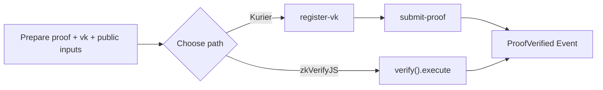

This page walks you through the shortest path to a successful zkVerify submission. You will learn the minimum inputs required, how Kurier and zkVerifyJS differ, and what a completed verification loop looks like. If you want the fastest start, Kurier is usually simpler; if you need direct on-chain control from the beginning, use zkVerifyJS.

To avoid getting stuck on environment setup, this page keeps only the minimum steps. You need three things: a proof, a vk, and public inputs. The Kurier path registers the vk first. The zkVerifyJS path submits the verification request directly on-chain.

If you want to look at a running example first, open the [zkEscrow demo](https://zk-escrow.vercel.app/escrow). It gives you a concrete feel for the end-to-end verification loop before you wire your own app.



## Path A: Kurier (REST API)

Kurier requires an API key. Request one first, then place it in `.env`.

```text
API_KEY=your_kurier_api_key
```

The minimal request structure for registering a vk is shown below (Groth16 example):

```ts
const regParams = {
  proofType: "groth16",
  proofOptions: { library: "snarkjs", curve: "bn128" },
  vk: key
}
const regResponse = await axios.post(`${API_URL}/register-vk/${process.env.API_KEY}`, regParams)
```

The minimal structure for submitting a proof is shown below (UltraHonk example):

```ts
const params = {
  proofType: "ultrahonk",
  vkRegistered: true,
  chainId: 11155111,
  proofData: {
    proof: proof.proof,
    publicSignals: proof.pub_inputs,
    vk: vk.vkHash || vk.meta.vkHash
  }
}
const requestResponse = await axios.post(`${API_URL}/submit-proof/${process.env.API_KEY}`, params)
```

After submission, poll `job-status` until the status becomes `Finalized`:

```ts
const jobStatusResponse = await axios.get(
  `${API_URL}/job-status/${process.env.API_KEY}/${requestResponse.data.jobId}`
)
if (jobStatusResponse.data.status === "Finalized") {
  // verified
}
```

## Path B: zkVerifyJS (Direct Chain Interaction)

zkVerifyJS requires a seed phrase to sign transactions, and the account must hold tVFY to pay transaction fees.

```text
SEED_PHRASE="this is my seed phrase i should not share it with anyone"
```

Start a session and submit the verification request:

```ts
const session = await zkVerifySession.start().Volta().withAccount(process.env.SEED_PHRASE)
await session.verify()
  .groth16({ library: Library.snarkjs, curve: CurveType.bn128 })
  .execute({
    proofData: { vk: key, proof: proof, publicSignals: publicInputs },
    domainId: 0
  })
```

## Common Failure Points

The most common issue is passing vk or public inputs in the wrong format, which causes the verification result to never appear. On the Kurier path, first confirm that `register-vk` successfully returned the vk hash before submitting the proof. On the zkVerifyJS path, confirm the account has tVFY, otherwise the transaction will not be accepted on-chain.
