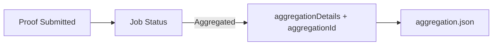

This page shows what changes once you move from verify-only to verify + aggregate. The goal here is to recognize the receipt-related output, understand which fields are returned at `Aggregated`, and know what data must be saved for later contract consumption.

The simplest mental model is “get the receipt.” A proof passing verification does not mean you already have a consumable result. Only after aggregation and `aggregationDetails` do downstream systems have enough material to prove “this proof is included in the batch.”

On the Kurier path, when status is `Aggregated`, the response includes `aggregationDetails` and `aggregationId`. Minimal write example:

```ts
if (jobStatusResponse.data.status === "Aggregated") {
  fs.writeFileSync(
    "aggregation.json",
    JSON.stringify({
      ...jobStatusResponse.data.aggregationDetails,
      aggregationId: jobStatusResponse.data.aggregationId
    })
  )
}
```

The most important fields in `aggregationDetails` describe the receipt, leaf position, and Merkle proof inputs:

```json
{
  "receipt": "0x...",
  "receiptBlockHash": "0x...",
  "root": "0x...",
  "leaf": "0x...",
  "leafIndex": 6,
  "numberOfLeaves": 8,
  "merkleProof": ["0x...", "0x..."]
}
```

Think of it as a “batch receipt.” The receipt is the root for the batch, and `leaf` + `merkleProof` locate your proof inside it. These fields are used later for on-chain consumption.

> 📌 Note: You only get `aggregationDetails` once status reaches `Aggregated`.

This diagram shows the data flow and where the receipt appears:



If you only need verify-only, you can skip this step. But if a contract must consume results, this receipt is mandatory.
