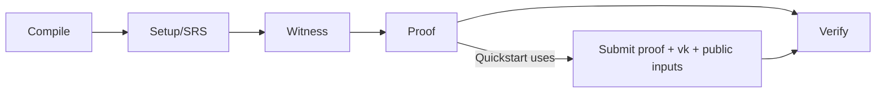

This page maps the Quickstart steps back to the full zkVerify flow. You already ran the shortest path; here the goal is to place that path inside the larger lifecycle so the event you saw and the artifacts you passed have a clear place in the system.

First, what steps actually occurred? You prepared proof, vk, and public inputs, then submitted them to zkVerify. Once on-chain verification succeeded, it emitted `ProofVerified` — the “verification success” you saw in Quickstart. In lifecycle terms, this corresponds to the “Proof” and “Verify” stages. Compile, setup, and witness happened inside your proving toolchain, but Quickstart didn’t expand them.

This diagram aligns Quickstart with the full lifecycle:

Now map the roles. The Producer writes the circuit/program and defines where vk comes from — that work is done before Quickstart. The Prover generates the proof, usually on the client/user side. The Verifier is zkVerify: it receives proof, vk, and public inputs, and emits `ProofVerified` on success.

A simple responsibility table helps keep the roles straight:

| Role | Responsibility | Where it appears in Quickstart |
| --- | --- | --- |
| Producer | Defines the circuit/program and vk | Implicit when you prepare the vk |
| Prover | Generates the proof | Completed before you submit the proof |
| Verifier | Verifies the proof | zkVerify emits `ProofVerified` |

The most common confusion is treating zkVerify as a Prover. The symptom is looking for “proof generation APIs.” The fix is simple: zkVerify only verifies, it does not generate proofs.

The next chapter will explain what happens before proof generation and after verification so you can place Quickstart inside the full system.
