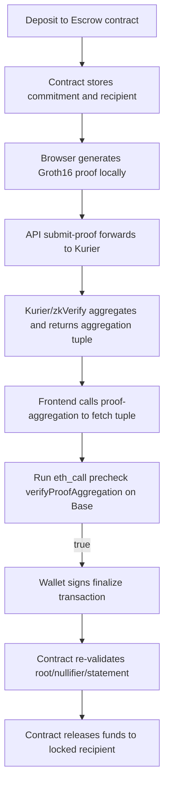
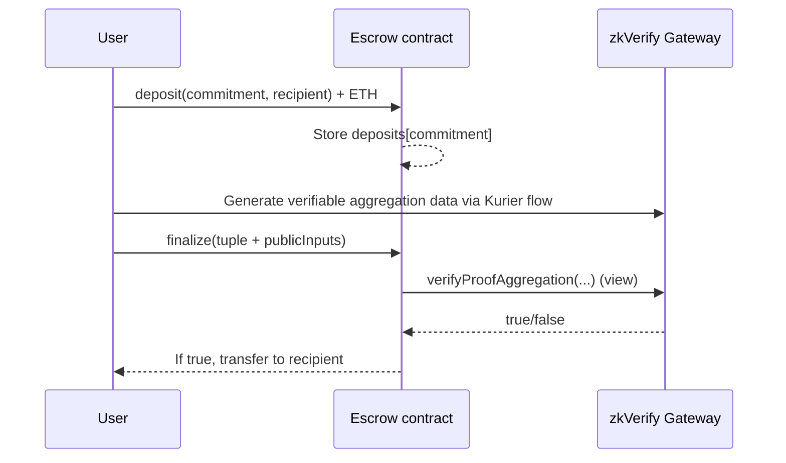

# ZK Escrow Hands-on Tutorial: Core Code Explained

> Target audience: developers building ZK + Merkle + on-chain aggregation verification for the first time.
> Goal: clearly explain why release works, why reverts happen, and what each code block is protecting against.

---

## 1. Global view first: what is this system actually proving

This project is not proving "who someone is." It proves the following:

1. A given `commitment` is indeed in the on-chain Merkle tree (membership proof).
2. The unlock initiator really knows the secret corresponding to that commitment (`nullifier + secret`).
3. The request is bound to current business domain, app ID, chain ID, and timestamp, preventing cross-context replay.
4. The same nullifier cannot be consumed twice (anti double-spend/replay).

---

## 2. End-to-end flow



### Most critical boundaries in this diagram

- `eth_call verifyProofAggregation` is a **read call** and does not trigger wallet signing.
- Actual on-chain writes only happen in two steps: `deposit` and `finalize`.
- Kurier's `Aggregated/Finalized` status is upstream progress, not equal to business-level payout success.

---

## 3. Circuit layer: expressing "eligible to unlock" with constraints

File: `circuits/escrow/circom/escrowRelease.circom`

### 3.1 Public/private input split

```circom
// Public inputs
signal input merkleRoot;
signal input nullifierHash;
signal input commitment;
signal input domain;
signal input appId;
signal input chainId;
signal input timestamp;

// Private inputs
signal input nullifier;
signal input secret;
signal input merklePath[levels];
signal input merkleIndex[levels];
```

Explanation:

- `public`: visible to any verifier and must be re-verifiable.
- `private`: used only during browser witness generation and never posted on-chain.

### 3.2 Core constraints

```circom
hasher.nullifierHash === nullifierHash;
hasher.commitment === commitment;

tree.leaf <== hasher.commitment;
tree.root <== merkleRoot;
```

These constraints guarantee two things:

1. `nullifierHash` and `commitment` are not arbitrary; they must come from the same secret inputs.
2. That `commitment` must reconstruct to the public `merkleRoot` through `merklePath/merkleIndex`.

---

## 4. Merkle tree layer: how on-chain "verifiable set" is maintained

File: `contracts/src/MerkleTreeWithHistory.sol`

### 4.1 Insert leaves

```solidity
uint32 leafIndex = _insert(commitment);
emit MerkleRootUpdated(getLastRoot(), leafIndex);
```

On each `deposit`:

- New commitment is inserted into the tree.
- Root is updated and stored in history ring.

### 4.2 Why root history is needed

The contract does not only accept the latest root. It keeps a history window (`ROOT_HISTORY_SIZE`) to handle normal latency between proof generation and on-chain state.

### 4.3 Validation entry point

```solidity
function isKnownRoot(bytes32 _root) public view returns (bool)
```

Before `finalize`, it first checks whether root exists in on-chain history; otherwise it reverts.

---

## 5. Anti-replay: `nullifierUsed` is the final gate

File: `contracts/src/ZKEscrowRelease.sol`

```solidity
mapping(bytes32 => bool) public nullifierUsed;

require(!nullifierUsed[nullifierHash], "nullifier used");
nullifierUsed[nullifierHash] = true;
```

Design intent:

- The same credential can succeed only once.
- Any second attempt reverts even if all other inputs are correct.

This is the actual business-level anti-replay control.

---

## 6. Contract finalize: understand each require in order

File: `contracts/src/ZKEscrowRelease.sol`

### 6.1 Group 1: business binding

```solidity
require(isKnownRoot(merkleRoot), "root not known");
require(domain == expectedDomain, "domain mismatch");
require(appId == expectedAppId, "appId mismatch");
require(chainId == expectedChainId && chainId == block.chainid, "chainId mismatch");
```

Meaning:

- Root must have actually appeared on-chain.
- Proof must belong to this business domain/app/chain and cannot be reused cross-system.

### 6.2 Group 2: aggregated proof verification

```solidity
bytes32 leaf = _statementHash(publicInputs);
bool verified = zkVerify.verifyProofAggregation(
    domainId,
    aggregationId,
    leaf,
    merklePath,
    leafCount,
    index
);
require(verified, "zkverify invalid");
```

This step does not trust text status. It directly calls zkVerify gateway on Base to verify tuple + statement matching.

### 6.3 Group 3: consume and transfer

- `nullifier` must be unused
- `deposit` must exist and be unspent
- mark spent + mark nullifierUsed
- transfer to recipient locked at deposit time

---

## 7. Why `zkverify invalid` is frequent: statement protocol drifts easily

File: `contracts/src/ZKEscrowRelease.sol`

```solidity
bytes32 le = _toLittleEndian(publicInputs[i]);
bytes32 pubsHash = keccak256(pubs);
bytes32 ctxHash = keccak256(bytes("groth16"));
return keccak256(abi.encodePacked(ctxHash, vkHash, VERIFIER_VERSION_HASH, pubsHash));
```

Statement is a cross-system protocol:

- input ordering must match
- value normalization rules must match
- byte order must match (little-endian here)

Any mismatch causes `verifyProofAggregation` to return false.

---

## 8. Kurier API layer: it is not "verifying"; it is "forwarding + structured parsing"

### 8.1 submit-proof

File: `apps/web/src/pages/api/submit-proof.ts`

```ts
const submitPayload = {
  proofType: 'groth16',
  chainId: Number(chainId),
  vkRegistered: true,
  proofOptions: { library: 'snarkjs', curve: 'bn254' },
  proofData: {
    proof,
    publicSignals: publicInputs,
    vk: vkHash,
  },
};
```

Key point of this route is validating bindings before forwarding, for example:

- `publicInputs[3] == domain`
- `publicInputs[4] == appId`
- `publicInputs[5] == chainId`
- `publicInputs[1] == antiReplay.nullifier`

### 8.2 proof-aggregation

File: `apps/web/src/pages/api/proof-aggregation.ts`

This route normalizes Kurier responses into a unified tuple:

- `domainId`
- `aggregationId`
- `leafCount`
- `index`
- `merklePath`
- `leaf`

When fields are incomplete, it returns `availableKeys` to quickly locate "missing upstream fields" vs "contract logic issues."

---

## 9. Frontend state machine: why it does not blind-sign on errors

File: `apps/web/src/pages/escrow.tsx`

### 9.1 Precheck (no wallet popup)

```ts
const zkvOk = await publicClient.readContract({
  address: zkVerifyAddr,
  abi: zkVerifyAbi,
  functionName: 'verifyProofAggregation',
  args: [domainIdFromAgg, aggregationId, localStatement, merklePath, leafCount, index],
});
```

### 9.2 Actual transaction send (wallet popup)

```ts
const txHash = await writeContractAsync({
  address: escrowAddress,
  abi: escrowAbi,
  functionName: 'finalize',
  args: [domainIdFromAgg, aggregationId, merklePath, leafCount, index, publicInputs],
});
```

If precheck fails, flow errors out immediately and never enters wallet-signing phase.

---

## 10. Fund flow (avoid misreading)



If some transaction rows in browser show `Value = 0`, it may only mean the call itself did not carry ETH. Whether payout succeeded should be judged by:

- `Finalized` event
- recipient balance change

---

## 11. Four variables beginners most often confuse

- `DOMAIN`: circuit business domain (public input)
- `KURIER_ZKVERIFY_DOMAIN_ID`: aggregation domain (for gateway verification)
- `VK_HASH`: verification key hash bound in contract
- `HASHER_ADDRESS`: Merkle tree hasher contract address

Recommended: run a checklist for these four before deployment. If any mismatch exists, do not send on-chain transactions.
