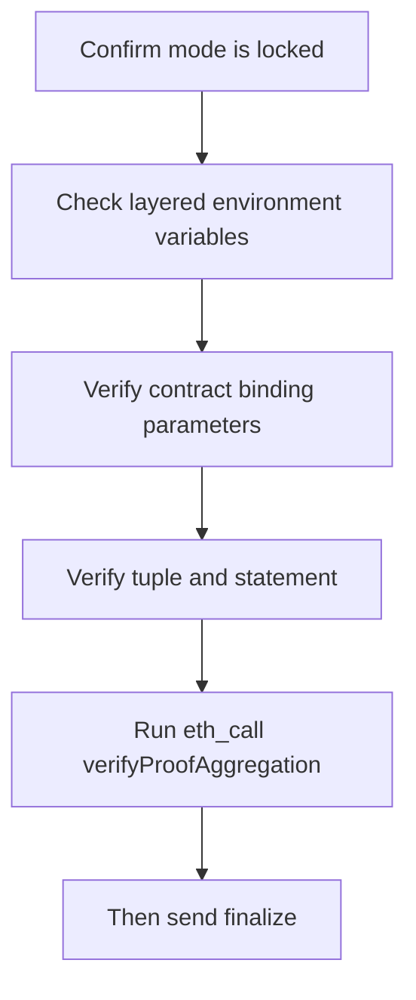

# ZK Escrow Hands-on Tutorial: Common Pitfalls and How to Avoid Them

> Target audience: developers building ZK Escrow for the first time.
> This document is based on real troubleshooting records and organized as: symptom -> root cause -> shortest diagnostic command -> fix action.

---

## 1. Mixed routes (aggregation / direct / local verifier)

### Symptom

- `proofOptions Required`
- `INVALID_SUBMISSION_MODE_ERROR`
- `Aggregation proof fields missing from Kurier response`

### Root cause

Different submission modes were mixed in the same branch, causing payload and state-gate conflicts.

### Shortest diagnostic command

```bash
rg -n "submissionMode|API_VERSION|proofOptions|vkRegistered" \
apps/web/src/pages/api/submit-proof.ts
```

### Fix action

- Keep only one mode per branch.
- In this repository, route is fixed to aggregation; do not keep direct logic in `submit-proof`.

---

## 2. Confusing business domain with aggregation domainId

### Symptom

- `Aggregation domainId mismatch`
- Proof has `domain=1`, but aggregation verification still fails.

### Root cause

`DOMAIN` (business) and `KURIER_ZKVERIFY_DOMAIN_ID` (aggregation) have different semantics but were treated like the same variable.

### Shortest diagnostic command

```bash
cat apps/web/.env.local | rg "DOMAIN|domainId|KURIER_ZKVERIFY_DOMAIN_ID"
```

### Fix action

- Keep: `NEXT_PUBLIC_DOMAIN=1`
- Keep: `KURIER_ZKVERIFY_DOMAIN_ID=2` (Base Sepolia aggregation domain)
- Always use distinct field names in code.

---

## 3. `zkverify invalid` (most common)

### Symptom

- `The contract function "finalize" reverted with the following reason: zkverify invalid`

### Root cause (ordered by likelihood)

1. Statement algorithm or byte order mismatch
2. Tuple parameter mismatch (`domainId/aggregationId/leafCount/index/merklePath`)
3. Contract binding parameter mismatch (`vkHash/domain/appId/chainId`)

### Shortest diagnostic command

```bash
# 1) Contract binding parameters
cast call $ESCROW "vkHash()(bytes32)" --rpc-url "$RPC_URL"
cast call $ESCROW "expectedDomain()(uint256)" --rpc-url "$RPC_URL"
cast call $ESCROW "expectedAppId()(uint256)" --rpc-url "$RPC_URL"
cast call $ESCROW "expectedChainId()(uint256)" --rpc-url "$RPC_URL"

# 2) tuple
curl -s -X POST "http://localhost:3000/api/proof-aggregation" \
  -H "Content-Type: application/json" \
  --data "{\"proofId\":\"$JOB_ID\"}"
```

### Fix action

- First ensure `statement == leaf`.
- Then ensure `verifyProofAggregation(...) == true`.
- Only then send `finalize`.

---

## 4. `root not known` / `root not allowed`

### Symptom

- `root not known`
- `root not allowed`
- `Local tree root mismatch`

### Root cause

- Wrong scan start height (missed deposit)
- Hasher address or tree parameters mismatch
- Stale local cache

### Shortest diagnostic command

```bash
cast call $ESCROW "nextIndex()(uint32)" --rpc-url "$RPC_URL"
cast call $ESCROW "getLastRoot()(bytes32)" --rpc-url "$RPC_URL"
cast call $ESCROW "hasher()(address)" --rpc-url "$RPC_URL"

curl -s "http://localhost:3000/api/commitments?statusOnly=1"
```

### Fix action

- Set `NEXT_PUBLIC_DEPLOY_BLOCK` to the deployment block of the current escrow contract.
- Confirm `HASHER_ADDRESS` matches the actual on-chain value.
- Trigger one rescan (reset) if needed.

---

## 5. Kurier is Aggregated, but frontend does not continue

### Symptom

- Stuck at pending/aggregated
- No follow-up verification or wallet popup

### Root cause

- `NEXT_PUBLIC_KURIER_REQUIRE_FINALIZED=true` blocks flow at finalized gate.

### Shortest diagnostic command

```bash
cat apps/web/.env.local | rg "NEXT_PUBLIC_KURIER_REQUIRE_FINALIZED"
```

### Fix action

- For aggregation route, set it to `false`.
- Use on-chain `verifyProofAggregation` precheck as the actual gate.

---

## 6. `forge create` still dry-runs even with `--broadcast`

### Symptom

- `Warning: Dry run enabled, not broadcasting transaction`

### Root cause

Environment contamination, argument ordering, or terminal env not fully sourced.

### Shortest diagnostic command

```bash
env | grep -i FOUNDRY
forge create --help | rg -n "dry|broadcast"
```

### Fix action

```bash
cd contracts
set -a; source .env; set +a
forge create --broadcast --rpc-url "$RPC_URL" --private-key "$PRIVATE_KEY" ...
```

---

## 7. `eth_getLogs` returns 400/503/range-limit errors

### Symptom

- Free tier limit: max 10 blocks per request
- Backend unhealthy / 429

### Root cause

Full-range block scans + high-frequency polling trigger RPC rate limits.

### Shortest diagnostic command

```bash
curl -s -X POST "$RPC_URL" \
  -H "Content-Type: application/json" \
  --data '{"jsonrpc":"2.0","id":1,"method":"eth_blockNumber","params":[]}'
```

### Fix action

- Use incremental indexing (`deployBlock + lastScannedBlock`)
- Use The Graph as primary read source
- Avoid large-range log scans directly in browser

---

## 8. CORS + 429 (frontend calling RPC directly)

### Symptom

- Browser console shows `blocked by CORS policy`
- `429 Too Many Requests`

### Root cause

Frontend directly requests restricted RPC endpoints.

### Shortest diagnostic command

```bash
# Validate RPC availability in server environment
curl -s -X POST "$RPC_URL" \
  -H "Content-Type: application/json" \
  --data '{"jsonrpc":"2.0","id":1,"method":"eth_blockNumber","params":[]}'
```

### Fix action

- Move on-chain reads to API layer (server side) as much as possible.
- Frontend should only call your own `/api/*` routes.

---

## 9. Subgraph build failure (AssemblyScript types)

### Symptom

- `Property 'toBigInt' does not exist on type ArrayBufferView`

### Root cause

Mapping treats `bytes32` as `BigInt`, causing type mismatch.

### Shortest diagnostic command

```bash
cd indexer/subgraph
npm run build
```

### Fix action

- Persist `bytes32` fields as `Bytes` or hex string.
- Do not call `toBigInt()` on `bytes32` directly in mapping.

---

## 13. Recommended troubleshooting order



Following this order usually avoids repeated rework where fixing one issue breaks three others.
