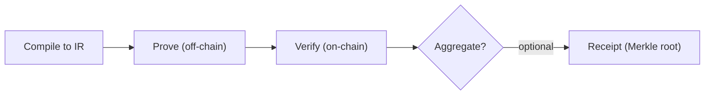

This chapter lays out the path from proof generation to verification, optional aggregation, and final consumption. When those stages get mixed together, debugging becomes guesswork. Once the order is clear, the engineering boundaries are easier to work with.

From a systems perspective, proof generation happens off-chain, while verification usually happens on-chain. The generation flow includes "compile to intermediate representation -> produce the proof off-chain." The verification stage runs on-chain and returns a result, and verification is usually much faster than proving. That is why Quickstart only showed verification and not compile or witness generation.

Whether this flow proceeds into aggregation is an engineering decision. Aggregation is optional and mainly exists to amortize costs. If your consumer does not live on-chain, you can stop at the verification result and skip the receipt publication path.

This guide treats prover, verifier, and witness as the core components of a ZKP system. You will keep encountering these three names in toolchains, interfaces, and logs. They map to proof generation, proof verification, and the input material the proof depends on.

| Component | Where it appears | Where you encounter it |
| --- | --- | --- |
| Prover | Proof generation | When running the proving toolchain |
| Verifier | Proof verification | During on-chain verification or zkVerify verification |
| Witness | Proof generation | When preparing input material |

> 📌 Note: Aggregation is optional. Its purpose is not to make verification "more correct", but to make it cheaper.

The next two sections break this flow into roles and handoff points so you can see who produces each artifact and which stage is responsible when something goes wrong.
