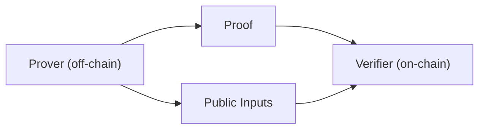

If you are new to ZK, the goal of this path is not to make you memorize terms. It is to build an engineering intuition you can actually use: proofs are produced off-chain, verification usually happens on-chain, and what you care about are system boundaries, data flow, and where to look when something fails, not the math details.

The basic properties of ZKPs are usually summarized in three phrases: zero knowledge, completeness, and soundness. For engineers, they imply two things: a proof can be verified without revealing the secret input, and the verification result is repeatable inside a system. You do not need the formal definitions here, but you do need to know these properties are hard constraints behind every later design choice.

The three most important concepts in a ZK system are prover, verifier, and witness. They are not just labels for roles. They describe three concrete responsibilities: who generates the proof, who verifies it, and where the input material required by the proof comes from. You will run into them constantly regardless of the library or framework you use.



This path assumes non-interactive proofs by default, because multi-round interaction is too expensive and awkward in blockchain environments. Non-interactive means the proving process must be packaged into a one-shot verifiable payload: proof + public inputs. You will see later that this is also why zkVerify’s verification interfaces always revolve around these fields.

Proof generation usually happens off-chain, and it is not a matter of "run code and get a proof." First the program is compiled into an intermediate representation, then it goes through polynomial transformations, commitments, Fiat-Shamir, and other backend steps before the proof is produced. Understanding this avoids a common mistake: slow proof generation does not mean the chain is slow. It is often just a local proving bottleneck.

> 💡 Tip: If this is your first time running proving, start with the smallest possible input and get the flow working before optimizing performance. Correctness matters more than speed at this stage.

Next you will face two major tradeoffs: SNARK vs STARK, and circuit systems vs zkVMs. SNARKs usually have smaller proofs and faster verification, but require trusted setup. STARKs are transparent, but proofs are larger and on-chain verification is more expensive. zkVMs are more general, but prover cost and proof size are both higher. These are not questions of "which is better" in the abstract. They are questions of which costs matter most in your system.

| Choice | Engineering meaning | When you encounter it |
| --- | --- | --- |
| SNARK | Smaller proofs and faster verification, but needs trusted setup | When you need the lowest on-chain cost |
| STARK | Transparent setup, but larger proofs and more expensive verification | When you do not want to depend on a trusted ceremony |
| zkVM | More general, but higher prover cost and larger proofs | When you want to reuse existing program logic |

This path uses one consistent example across the later concept pages, so you do not have to keep switching context between topics. You will see how commitment, Merkle tree, witness, and public inputs work together inside one story instead of appearing in isolation on unrelated pages.

```text
proof = Prove(compile_artifacts, witness)
public_inputs = ExtractPublicInputs(witness)
```

Once you enter zkVerify, you face one extra decision: whether you need aggregation. Aggregation is not mandatory. It mainly exists to amortize verification costs and turn multiple proofs into one consumable result. For now, just remember that it is optional. Later paths explain when it becomes necessary.

> ⚠️ Warning: Do not treat proof generation and proof verification as the same thing. Generation happens off-chain and verification happens on-chain. Every later system design decision depends on this distinction.

The job of this page is to give you an intuition framework that beginners can actually use. The next section starts from the smallest concepts and places these terms into a runnable engineering scenario built around one consistent example.
