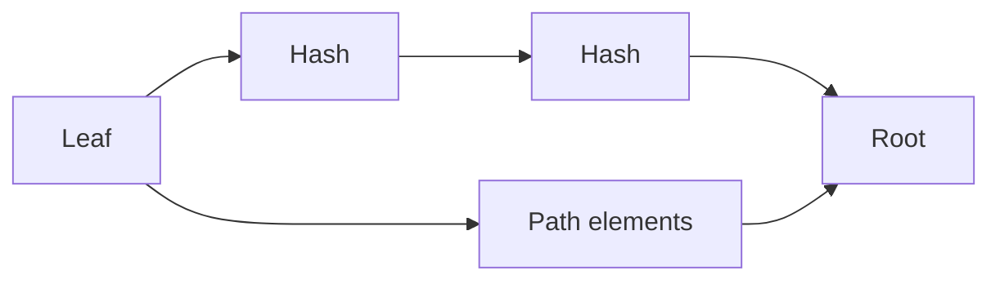

This page uses one small Merkle membership example to explain a core ZK concept: how to prove “I am in this tree” without exposing the whole dataset. The goal is not to implement a full circuit here, but to make the public/private input split and path structure easy to see.

We prove: **“My leaf is in this tree.”** That sentence carries two engineering constraints: you must not reveal full identity (private inputs stay private), and the verifier must be able to confirm quickly on-chain or backend (public inputs must be sufficient for verification).

Think of a Merkle tree as a “compressed roster.” The root is the roster digest; the path is your route from leaf to root. You don’t publish the whole roster—you publish the root and prove membership with a path.



**Public inputs** are usually the root. It is the “verifiable commitment.” The verifier uses it to confirm your path leads to the same root.

**Private inputs** are usually the leaf value (your identity/commitment) and the path data. The path reveals structure, not the full set of leaves.

Here is a minimal input structure sketch so you know what the circuit needs:

```text
publicInputs = { root }
privateInputs = { leaf, pathElements[], pathIndices[] }
```

Here are three common circuit variables:

- `cur`: the current hash, starting at the leaf and updated each level to the parent hash.
- `pathElements[]`: the sibling node hash at each level, used with `cur` to compute the parent.
- `pathIndices[]`: tells the circuit whether `cur` is left or right at each level. Without direction, you compute the wrong parent.

An intuitive analogy is “receipt + inspection route.” The root is the master receipt number, `pathElements` are the checkpoints, and `pathIndices` tell left/right turns. Miss any piece and the final number won’t match.

```text
cur = leaf
for i in 0..depth-1:
  if pathIndices[i] == 0:
    cur = Hash(cur, pathElements[i])
  else:
    cur = Hash(pathElements[i], cur)
assert cur == root
```

> 💡 Tip: Check `pathIndices` first when debugging. A wrong direction breaks the entire path and looks like a hash mismatch.

> ⚠️ Warning: Don’t submit all leaves as public inputs. That defeats the privacy purpose.

The point is not to write the circuit, but to understand why these fields must exist. The next section continues with the same example and shows how different proof systems handle it.
