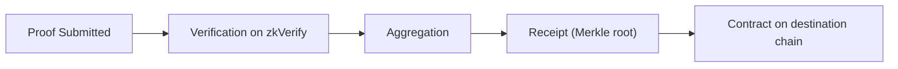

If you already understand the basics of ZK, this path focuses on a different question: **once a proof enters zkVerify, what happens next, and which parts still belong to your system**. A lot of integration problems come from assigning work to the wrong layer, not from broken proving logic.

Put zkVerify in its proper place first: it is a chain dedicated to verifying proofs, not a general-purpose contract platform. Its job is to receive proofs, verify validity, and turn the result into reusable output. When you integrate zkVerify, you are effectively taking the question "did this proof verify?" out of your application internals and turning it into a fact multiple systems can trust.

This path focuses on four things:

1) what happens after proof submission;
2) how verification results are aggregated into reusable outputs;
3) when and how results are published to other systems;
4) where you, as the developer, provide inputs and where you receive results back.

The easiest part to overlook is where the verification result ends up. Verification is only the beginning. What determines whether you can actually use the result is **aggregation and publication**. zkVerify sends verified proofs into the aggregation flow, generates a receipt (Merkle root), and then has a relayer publish it to a contract on the destination chain. For on-chain consumers, the contract does not see the raw proof. It sees the receipt and its inclusion path.

Another point you must care about is **cost structure**. zkVerify verifies on-chain, so every verification has a cost, and VFY is the medium used to pay it. That means you need to ask whether the cost of a single verification is acceptable, whether aggregation is needed to amortize it, and whether the result must be published to an on-chain consumer.

There is also a tooling choice here: use a relay API like Kurier, or interact with the chain directly. This is not a question of "advanced" versus "beginner." It is a tradeoff between control and complexity. Kurier gives you a more Web2-like experience, but it also means handing some on-chain interaction details over to it.

To avoid understanding the system without being able to implement it, split the whole process into three layers of responsibility:

- **Submission layer**: prepare proof, vk, and public inputs, and make sure they come from the same compiled artifacts;
- **Verification layer**: let zkVerify produce a reusable result;
- **Consumption layer**: decide whether the result is consumed inside the application or on-chain.

The rest of this path expands each layer into concrete mechanisms. You will see how the statement hash is formed during proof submission, what role domain plays in aggregation, how a published receipt is verified by contracts, and which on-chain information you must record at which step.

> 💡 Tip: If you can already generate proofs reliably but keep getting stuck on "how the result is actually used," the problem is usually not proving. It is usually whether the consumption layer is going through the aggregation/publication path.

> ⚠️ Warning: Do not treat zkVerify as a proving platform. It only verifies. It will not generate proofs for you, and it will not decide how your business logic should consume the result.

To quickly locate which layer you are currently in, use this short checklist:

1) Can I already generate proofs and public inputs reliably?
2) Am I getting stable verification results on zkVerify?
3) Does my result stay in the application, or does it need to be used by an on-chain contract?

Those three questions are enough to place your current integration stage. The next section starts with proof submission and then breaks the verification path into concrete mechanisms.
