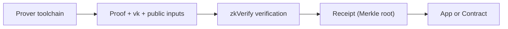

Before you integrate zkVerify deeply, you need a clean boundary: **what zkVerify owns, and what your system still owns**. If that line is blurry, proving logic, verification logic, and consumption logic start bleeding into each other.

The most important boundary is simple: zkVerify verifies, but it does not generate proofs. Proof generation happens in your proving toolchain, usually off-chain. You prepare the proof, vk, and public inputs, submit them to zkVerify, and then zkVerify returns the verification result. That is the core of its role as a verification layer.

In system terms, zkVerify is a Substrate-based L1 PoS chain with multiple verifier pallets, each supporting different proving systems. It is not a general-purpose contract platform. It is infrastructure designed specifically for proof verification. The reason to adopt it is to turn verification into an independent trusted fact, not to move application logic on-chain.

After verification, the result does not remain inside zkVerify. It can enter the aggregation flow, produce a proof receipt (Merkle root), and be published by a relayer to a contract on the destination chain. That means the verification layer gives you more than a yes/no answer. It also gives you a result artifact that on-chain systems can consume. For on-chain consumers, the contract sees the receipt, not the original proof.

To make the boundary explicit, here is a direct ownership split:

| Task | zkVerify owns it | You own it |
| --- | --- | --- |
| Proof generation | ✗ | ✓ |
| Proof verification | ✓ | ✗ |
| vk handling | Partial (at verification time) | ✓ (generation and version management) |
| Result consumption | ✗ | ✓ |

> 📌 Note: vk handling here refers to how it is used during verification. Generating it and managing versions remain your responsibility.

In real projects, this boundary shows up at three moments:

1) The first time you submit a proof to zkVerify, you notice it does not care about your business semantics. It only cares whether the proof is valid.
2) When you hand the result to an on-chain contract, you realize the contract consumes a receipt, not the raw proof.
3) When you debug failures, you often discover that "verification failed" actually means the proof and vk came from different versions, not that there is a chain logic bug.

A common misunderstanding is thinking zkVerify can absorb the complexity of proving. It cannot. It only handles verification. If you make a mistake on the proving side, zkVerify can only tell you the verification failed. It will not tell you where the proof was generated incorrectly. That is why getting the responsibility boundary right matters.

If you are designing a system, the most practical approach is to split responsibilities into three layers:

- **Generation layer**: circuits/programs and proof generation (you own it)
- **Verification layer**: proof verification and result production (zkVerify owns it)
- **Consumption layer**: how the app or contract uses the result (you own it)

This split helps you avoid two classic mistakes: pushing proving logic into the verification layer, which explodes cost and complexity, and treating a successful verification as "the business is done," while ignoring the work still required in the consumption layer.

> ⚠️ Warning: Do not treat "verification succeeded" as "the business is complete." Verification is only an intermediate step. You still have to land the result in the consumption layer.

Keep one boundary in mind as you move on: **zkVerify is the verification layer, not the proving layer and not the business layer**. The next section starts from proof submission and explains what the verification layer actually does internally.
