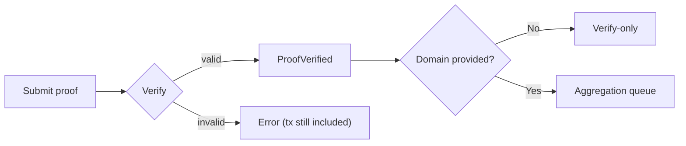

This section explains “what happens after proof submission.” The place you most often get stuck is not “how to submit,” but **how the system routes after submission**: which paths emit verification events, which enter aggregation, and which cases are rejected while the transaction still lands on-chain. Once you understand this flow, you can decide which events to listen to and when to take the next step.

Think of the submission flow as a “sorting center.” Once a proof enters zkVerify, it is verified first; if you choose the aggregation path, it is sent into a domain queue; if there is no domain, it runs verify-only. This routing is a hard boundary in the system design. Misunderstanding it leads to listening to the wrong events or missing critical data.

Start with the core input: zkVerify binds the proof into a statement hash. This hash is the “fingerprint” of the verification system, composed of the verification context, vk, proof version info, and public inputs. It is not business semantics, but it determines whether your later events, paths, and aggregation results line up.

```text
statement = keccak256(
  keccak256(verifier_ctx),
  hash(vk),
  version_hash(proof),
  keccak256(public_inputs_bytes)
)
```

If the proof passes verification, the system emits a `ProofVerified` event containing the statement value; if verification fails, the transaction is still included in a block, but errors out and still costs fees. This is key: **failure does not mean it never went on-chain**. It is a design choice to prevent DoS. Remember this when you build retry logic, or you will pay repeatedly.

Here is the minimal flow diagram so you can see the “verify-only vs verify+aggregate” split:



### Verify-only path (no aggregation)
The key trait of this path: you only care about verification events, not aggregation events. You submit a proof, listen for `ProofVerified` on success, take the statement value, and consume it in your application. There is no receipt, no Merkle path, and no domain.

**When should you use it?**
When your consumer is on the application side (Web2/backend service) and the verification result is only a business signal, verify-only is the shortest path.

**When should you not use it?**
When your consumer is an on-chain contract, verify-only does not produce a result a contract can consume; you need the aggregation path.

### Verify + Aggregate path (domain required)
The aggregation path starts with the domain. You provide a domainId when submitting the proof, and the system routes the proof to the next aggregation for that domain. When the proof is added, it emits `NewProof{statement, domainId, aggregationId}`. This is the only signal that confirms “the proof has entered the aggregation queue.”

Once aggregation completes, it emits `NewAggregationReceipt{domainId, aggregationId, receipt}`. The receipt here is the Merkle root, and on-chain consumption depends on it. Note: you must record the block hash that emitted the event, because later Merkle path computation must use the **same block**. If you lose that block hash, path retrieval will fail.

Another key action on the aggregation path is retrieving the Merkle path. Using the `aggregate_statementPath` RPC, you provide the block hash, domainId, aggregationId, and statement to retrieve the path. This path is your proof that “my proof is in this aggregation batch.”

### Domain-related rejections and fallbacks
Aggregation is not “guaranteed to succeed.” If the domainId does not exist, the domain cannot accept new proofs, the user lacks funds, or the user is not on the allowlist, the system emits a `CannotAggregate` event. Note that `submitProof` does not fail here; it only emits an event telling you “not aggregated.” If you only listen for `ProofVerified`, you will miss this signal.

Common `CannotAggregate` reasons include:

- `DomainNotRegistered{domainId}`
- `InvalidDomainState{domainId, state}`
- `DomainStorageFull{domainId}`
- `InsufficientFunds`
- `UnauthorizedUser`

These are not “verification failures,” but “aggregation failures.” You need to distinguish these two in your application logic.

### Kurier status flow (for external polling)
If you use Kurier, the status flow for verification appears as: `Queued` → `Valid` → `Submitted` → `IncludedInBlock` → `Finalized` or `Failed`. On aggregation flows, you may later also see `AggregationPending` → `Aggregated`. Current Kurier docs explicitly mark `AggregationPending` and `Aggregated` as chain-ID-dependent statuses, so do not compress the whole flow into a single rule like “no chainId means no statuses at all.”

> ⚠️ Warning: As long as you use on-chain verification, failed transactions are still included and charged. Do not rely on “infinite retries” as a fallback.

> 💡 Tip: If you want verify-only and possibly aggregation, listen to both `ProofVerified` and `CannotAggregate`, or you will misjudge the proof’s final path.

To close the section, here is a concise engineering checklist of “events you should watch”:

1) `ProofVerified`: proof verified, capture the statement.
2) `NewProof`: proof enters an aggregation queue, record domainId/aggregationId.
3) `NewAggregationReceipt`: aggregation completes, record the block hash.
4) `CannotAggregate`: aggregation failure reasons, not verification failures.

The next section focuses on domain semantics and the state machine, explaining why aggregation requires a domain, and when you should use it or avoid it.
