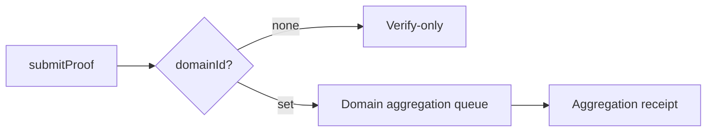
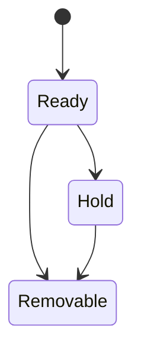

Domain is the first routing gate after proof submission. You do not need to treat it as an abstract concept, but you do need to know exactly where it appears in the system: **if you submit a proof with a domainId, the system routes it into the corresponding aggregation queue; if you omit domainId, the proof does not enter aggregation**. That behavior determines whether a receipt will exist later and whether the result can be consumed on-chain.

It helps to think of a domain as a mailbox. You drop a proof into a specific mailbox, and the mailbox rules determine whether it can be aggregated, when it will be aggregated, and who can publish the aggregation result. Different mailboxes have different capacity and policy rules, and those rules directly affect cost and availability.



**Where Domain Appears**
You see domainId explicitly in the submission interfaces when you choose the aggregation path: Kurier, zkVerifyJS, and PolkadotJS all expose it in `submitProof`. It is optional for verify-only, but it becomes the key routing parameter once you want aggregation. After verification, the system checks the domain. If no domainId is provided, no aggregation action is taken.

**What Problem Domain Solves**
The core value of a domain is that it fixes the aggregation context. It routes proofs into different aggregation queues based on target chain or policy. In practice, you run into problems like these:

- One system may have multiple consumption targets (different chains or different contracts), so proofs need to be separated by target.
- Different targets have different aggregation size and cost requirements, so they need different publication policies.
- You do not want every proof mixed into one aggregation, because that makes cost and publishing behavior hard to control.

Domain provides that isolation and routing capability. It is not decorative. It is the precondition that makes aggregation controllable.

**Hard Constraints Around Domain**
You cannot just put any number into domainId and expect it to work. The system validates the domain and emits `CannotAggregate` when aggregation cannot proceed. Common reasons include: the domain does not exist, the domain state does not accept new proofs, the domain queue is full, the account balance is insufficient, or the submitter is not on the allowlist.

These failures do not necessarily make `submitProof` fail immediately. Instead, you get "verification succeeded but aggregation did not happen." If you do not listen for `CannotAggregate`, you may wrongly assume the proof has entered aggregation. This is a very common engineering misdiagnosis.

**Capacity and Cost of a Domain**
Each domain has its own `aggregation_size` and `queue_size`. `aggregation_size` sets how many proofs fit into a single aggregation. `queue_size` sets how many aggregations can wait for publication. These values affect not only capacity, but also the cost profile of publication and consumption.

From a cost and permissions perspective, domains also involve deposits and token requirements: creating a domain requires a deposit, normal users can only register `Destination::None` domains, and only a Manager can register a destination-backed domain. In other words, "who can create a domain" is a permission boundary, not a minor implementation detail.

**Lifecycle and State Machine**
Domains have a state machine: Ready, Hold, and Removable. Only the domain owner can call `holdDomain` to move a domain into Hold or Removable. Once in those states, the domain no longer accepts new proofs and cannot return to Ready. In engineering terms, once you put a domain on Hold, it becomes a mailbox that has stopped accepting submissions, and the system will not recover it for you.



**When Domain Is Mandatory**
Strictly speaking, whether domain is mandatory depends on whether you need aggregation. The system behavior is: no domainId means no aggregation; a domainId means the proof enters an aggregation queue. So if your consumer needs a receipt (for on-chain consumption), you must choose a valid domain. If you are only doing verify-only, you can omit domainId.

**When Domain Is Optional**
If you only need the `ProofVerified` result and do not need a receipt or Merkle path, domainId can be omitted. The system verifies the proof and then does nothing else. That "nothing else" is not a bug. It is the design of verify-only mode.

**Minimal Input Shape**
Below is the structural difference between the two submission modes, which is useful when branching in code:

```text
// verify-only
submitProof({ proof, vk, publicInputs })

// verify + aggregate
submitProof({ proof, vk, publicInputs, domainId })
```

**Common Misunderstandings and Pitfalls**
The most common mistake is assuming that once a proof verifies, it will definitely be aggregated. In reality, verification and aggregation are separate stages. Aggregation requires a domain and that domain must satisfy state and capacity conditions. If you ignore this, you expect a receipt to appear even though the proof never entered the aggregation queue.

> ⚠️ Warning: `CannotAggregate` is not a verification failure. It is an aggregation failure. If you treat it as verification failure, you will diagnose the root cause incorrectly.

> 💡 Tip: If you plan to consume results on-chain, first confirm the domain exists and is in Ready state before submitting the proof. Do not wait until no receipt appears to start investigating.

To close the section, keep one engineering rule in mind: **domain is the entry point to aggregation, not the entry point to verification**. You only need to care about domain when you need a receipt. Otherwise, it is just one more failure mode. The next section explains the aggregation flow itself and shows how receipts are generated and published.
