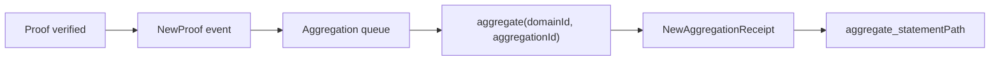

This section explains where aggregation sits in the flow and what it produces. If your result stays in Web2, verify-only may be enough. If the result must be consumed on-chain, aggregation moves from optional background detail to required path.

First place it in the flow: after a proof is submitted and verified, if it includes a domainId it is inserted into the corresponding aggregation queue. When it joins the queue, the chain emits `NewProof{statement, domainId, aggregationId}`. That event tells you which aggregation batch you entered.

When an aggregation is complete, any user can call `aggregate(domainId, aggregationId)` to generate the receipt. On success, the chain emits `NewAggregationReceipt{domainId, aggregationId, receipt}`. The block hash of that event is critical, because later Merkle path computation must use the same block.



The outputs of aggregation can be split into three layers:

1) **receipt (Merkle root)**: the root for a batch of proofs, which is all the contract verifies.
2) **aggregationId / domainId**: identifiers for which aggregation batch you belong to.
3) **Merkle path**: the proof that your statement is inside that tree.

On the Kurier path, once `job-status` reaches `Aggregated`, you receive `aggregationDetails`. It includes receipt, root, leaf, leafIndex, numberOfLeaves, and merkleProof. That package is the direct input for contract-side verification.

```ts
if (jobStatusResponse.data.status === "Aggregated") {
  fs.writeFileSync(
    "aggregation.json",
    JSON.stringify({
      ...jobStatusResponse.data.aggregationDetails,
      aggregationId: jobStatusResponse.data.aggregationId
    })
  )
}
```

If you use the chain interfaces directly, you need to listen for `NewAggregationReceipt`, record the block hash, and then call the `aggregate_statementPath` RPC to fetch the Merkle path. Note that Published storage is only valid at the block where the receipt was created. If you miss that block hash, you cannot retrieve the path.

```text
path = aggregate_statementPath(blockHash, domainId, aggregationId, statement)
```

Aggregation is not something the system silently completes for you. It is permissionless: any participant can publish an aggregation and claim the associated fee. That is why aggregation events are not triggered only by some fixed system service. They can be triggered by any participant, and your system cannot assume a single fixed publisher will always be the one to do it.

You also need to understand the boundary of aggregation failure: `aggregate` can fail, for example because the domain does not exist, the aggregationId is invalid, or it has already been published. When that happens, the publisher only pays the fail-fast cost, but your proof does not disappear. In engineering terms, the correct response is usually to wait for the next successful publication.

> ⚠️ Warning: You must record the block hash of `NewAggregationReceipt`, otherwise you will not be able to compute the Merkle path later.

> 💡 Tip: If contract-side verification fails, first check whether the Merkle path came from the correct receipt block. That mistake is more common than broken contract logic.

The aggregation engine generates the receipt and the data needed to prove inclusion inside that receipt. It does not decide how your application consumes the result. The next section compares Relay and Mainchain API so you can choose which interface path fits your integration.
