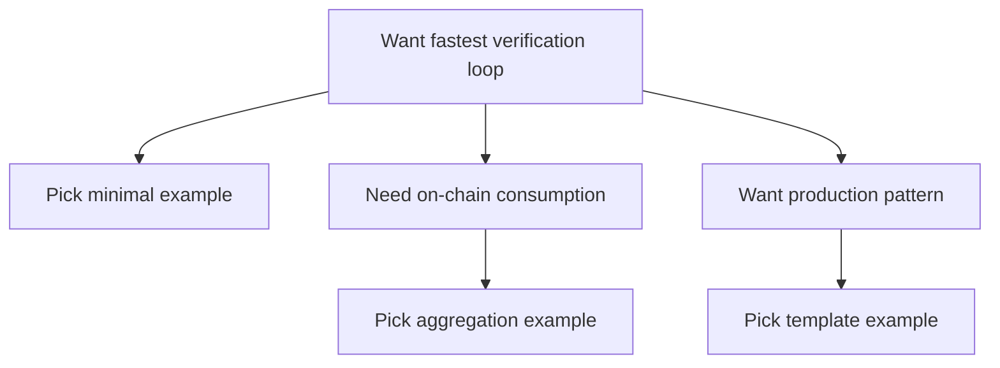

This path is for readers who want working examples first. The examples are arranged so you can validate a proof flow, inspect the inputs and outputs, and then expand into more realistic usage patterns.

The examples in this chapter are not random. They follow the sequence “minimal verifiable → reusable template → production patterns.” You can treat it as a progressive scaffold: start with the simplest proof submission and gradually see more engineering boundaries—how inputs are organized, how results are consumed, when aggregation is needed, and when it is not.

Each example is written to answer the same practical questions: what is being proved, which inputs are public, which stay private, and where the result is consumed. That gives you enough context to adapt an example instead of copying it blindly.

The proof systems and toolchains differ from one example to another, so do not expect one uniform interface. The useful goal here is simpler: pick one example that matches your situation and get that path running reliably.

Here is a minimal “example selection” path to help you decide where to start:



If you are not sure where to begin, use this order: run the minimal example first and confirm verification events appear; then run an aggregation example and confirm you can obtain a receipt; finally look at the production template to learn how to wire results back into business logic. This order is not mandatory, but it reduces pitfalls.

Use these examples as starting points, not as isolated demos. The useful parts to carry over are the input shape, submission path, event handling, and result-consumption pattern.

```text
Example skeleton:
1) Prepare inputs
2) Generate proof
3) Submit proof
4) Observe verification result
5) Consume result
```

> 💡 Tip: Add logging and event listeners first. Many “it does not run” issues are not proof errors, but that you never saw the verification events.

> ⚠️ Warning: Do not treat examples as “production defaults.” Examples explain structure and paths, not your business boundaries.

If you already have business logic in place, start with the example closest to your target flow and adapt the inputs and consumption path from there. The next section is the minimal example list.
