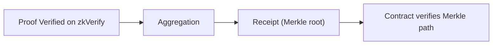

This path is about contract-side consumption: **if a verification result needs to be used on-chain, what data does the contract actually need?** Many integration failures here are not about proof correctness. They come from not having the receipt data the contract expects.

You need to accept a reality: contracts will not re-verify a full proof. They consume the aggregated receipt (Merkle root) and your Merkle path. In other words, **zkVerify verifies the proof; the contract verifies “you are in the receipt.”** This boundary means you must use the verify + aggregate path.

This chapter splits the “contract consumption” path into two parts:

- **With a contract**: you need receipt, aggregationId, domainId, and Merkle path, and you verify them in the contract.
- **Without a contract**: you only need the verification event or job-status result, and consume on the Web2 side.

If you do cross-chain or multi-contract consumption, aggregation is not an “optional optimization,” but a “required path.” The receipt is the minimal unit of on-chain trust; it lets the contract verify one root instead of N proofs.

You will face two engineering questions in this chapter:

1) How do I get the receipt and Merkle path?
2) How does the contract verify I am in the receipt?

These two questions run through every page that follows. If you remember only one sentence: **on-chain consumption requires a receipt, not a proof**.

> ⚠️ Warning: Submitting a proof alone will not produce a contract-usable result. Without a receipt, the contract cannot verify that your proof was accepted by zkVerify.

> 💡 Tip: If you only consume on the Web2 side, do not introduce the contract flow yet. Verify-only gets you live faster, then you can decide whether to enter aggregation.

The next section starts with the case where you already have a contract and need the full receipt path, then comes back to the lighter Web2-only flow.
