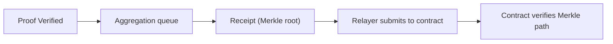
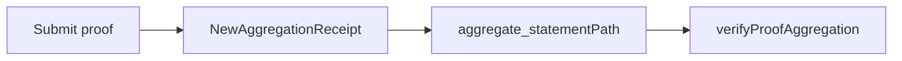

This section is for integrations that already have a contract. The key question is not whether a proof exists, but **which on-chain data lets the contract trust the verification result**. The answer is receipt plus Merkle path, not the raw proof. That is why this path necessarily goes through verify + aggregate.

The following diagram shows the end-to-end structure, with emphasis on how data moves from zkVerify to the contract:



## 1) How the Receipt Reaches the Contract

zkVerify generates the receipt when aggregation completes, and a relayer publishes it to the zkVerify contract on the destination chain. Inside the contract, an internal mapping records aggregation results:

```solidity
mapping(uint256 => mapping(uint256 => bytes32)) public proofsAggregations;
```

The publication entrypoints are `submitAggregation` and `submitAggregationBatchByDomainId`. The first submits a single aggregation, while the second submits a batch and saves gas:

```solidity
function submitAggregation(
    uint256 _domainId,
    uint256 _aggregationId,
    bytes32 _proofsAggregation
) external onlyRole(OPERATOR);

function submitAggregationBatchByDomainId(
    uint256 _domainId,
    uint256[] calldata _aggregationIds,
    bytes32[] calldata _proofsAggregations
) external onlyRole(OPERATOR);
```

If you are the contract consumer, you do not need to call these functions yourself, but you do need to understand how the receipt is written into the contract. Otherwise you will not be able to explain why the contract does not contain the root you expect.

## 2) How Do I Retrieve the Merkle Path?

After the proof has been aggregated, you need its position inside the tree. You can get it through events and RPC:

- Listen for the `NewAggregationReceipt` event and record `domainId`, `aggregationId`, and the **block hash where the event was emitted**.
- Use the `aggregate_statementPath` RPC with the block hash, domainId, aggregationId, and statement to retrieve the Merkle path.

The easiest detail to miss here is the block hash. Published storage only exists at the block where the receipt was generated. If you miss that block hash, you cannot recover the path.

```text
path = aggregate_statementPath(blockHash, domainId, aggregationId, statement)
```

## 3) How the Contract Verifies Inclusion

The contract-side verification entrypoint is `verifyProofAggregation`. It checks that the aggregation exists and uses the Merkle path to verify your leaf:

```solidity
function verifyProofAggregation(
    uint256 _domainId,
    uint256 _aggregationId,
    bytes32 _leaf,
    bytes32[] calldata _merklePath,
    uint256 _leafCount,
    uint256 _index
) external view returns (bool);
```

Its core logic is simply a Merkle verification against the root:

```solidity
return Merkle.verifyProofKeccak(
  proofsAggregation,
  _merklePath,
  _leafCount,
  _index,
  _leaf
);
```

The key inputs you need to provide are aggregationId, domainId, leaf, Merkle path, leafIndex, and numberOfLeaves. Most of these come from the aggregation result or from aggregationDetails. Only the hash of the public inputs must come from the proof-generation side.

```text
inputs = { domainId, aggregationId, leaf, merklePath, leafIndex, numberOfLeaves }
```

## 4) A Minimal Contract Consumption Flow

1) Submit the proof so it enters the aggregation queue.
2) Listen for `NewAggregationReceipt` and record the block hash.
3) Use `aggregate_statementPath` to retrieve the Merkle path.
4) Assemble the leaf and path, then call `verifyProofAggregation`.



> ⚠️ Warning: If you do not record the block hash of the receipt event, you will not be able to compute the Merkle path later.

> 💡 Tip: When contract verification fails, first check whether leafIndex and numberOfLeaves match the receipt. If the order is wrong, verification fails immediately.

Keep the boundary simple: **the contract consumes receipt + Merkle path, not the raw proof**. The next section shows the lighter path when you do not yet have a contract.
