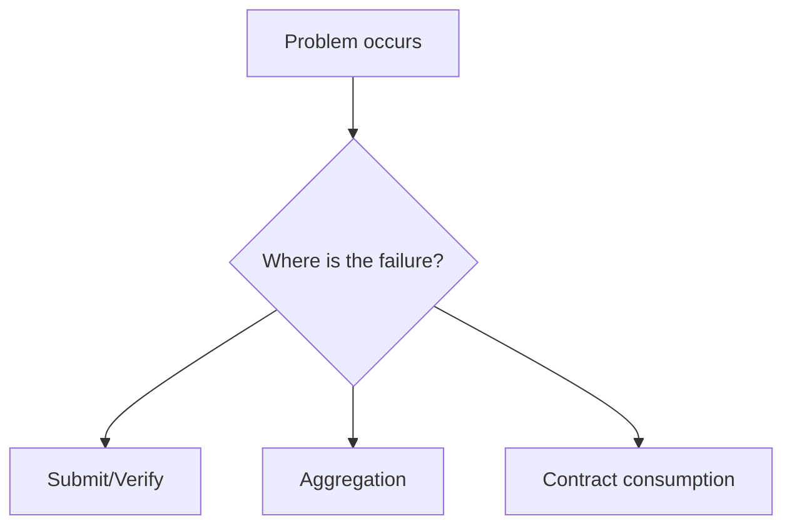

This chapter is organized for troubleshooting. Use it when the flow is stuck: no verification events, no aggregation receipt, contract verification failures, or statuses that stop moving.

A practical way to read is to ask yourself three questions:

1) Am I stuck before submission, after verification, or after aggregation?
2) Did I receive `ProofVerified` or `NewAggregationReceipt` events?
3) Am I consuming on the Web2 side or the contract side?

If you can answer these three questions, diagnosis gets much faster. Many “complex” issues are just stuck on a single step, such as missing the block hash, a domain that cannot aggregate, or missing chainId preventing status updates.

This chapter also answers frequent questions such as “when do I need a domain,” “why does the tutorial not mention domains,” and “why does contract verification fail even though the proof passed.” The common causes are usually not zkVerify itself, but how it is used.

If you cannot find the answer here, prioritize filling in your logs and event records. Many issues are not system errors, but missing key context like statement values, aggregationId, or the receipt’s block hash. Without these fields, it is hard to tell which layer failed.

> 💡 Tip: When debugging, first confirm you are listening to the correct events. Listening to the wrong events is the most common “false outage.”

> ⚠️ Warning: Do not mix verification failures with aggregation failures. Verification failure means the proof itself did not pass; aggregation failure is usually a domain or permission issue.

The next section starts with the most common failure patterns and the shortest checks for each one.
