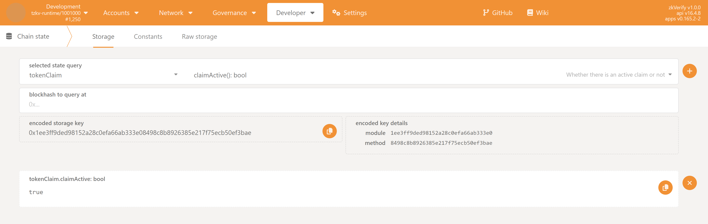
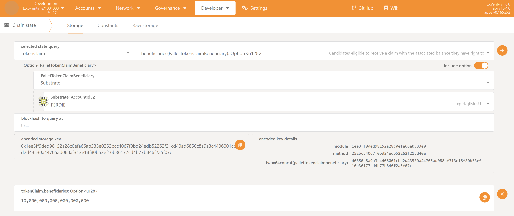
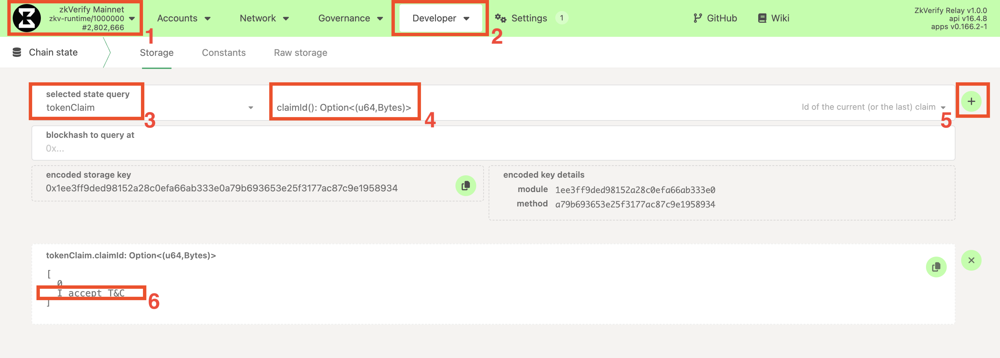
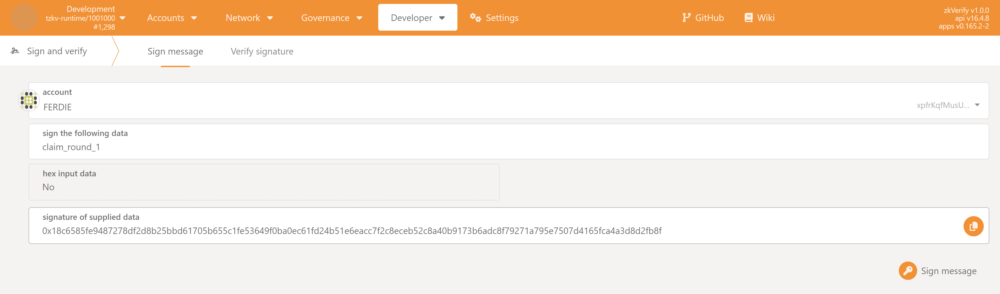
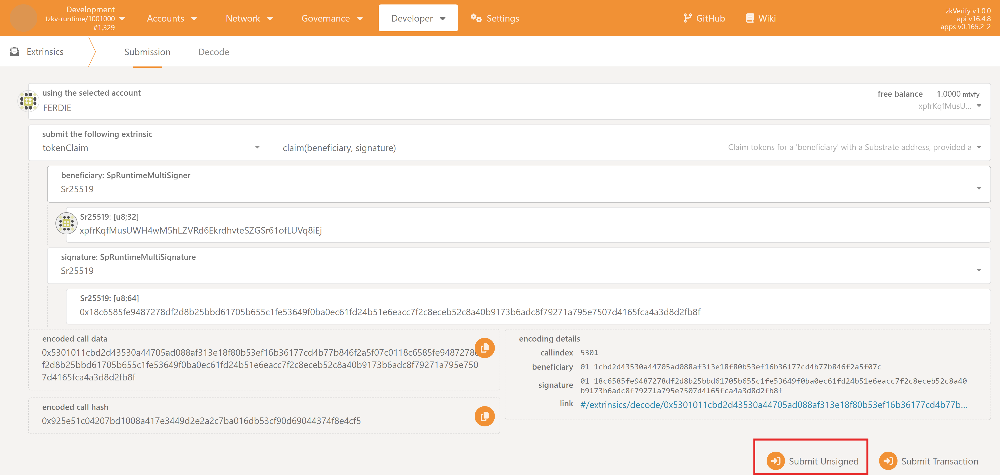

import Tabs from '@theme/Tabs';
import TabItem from '@theme/TabItem';

This guide will walk you through the process of claiming your tokens if your Substrate address was included as a beneficiary.

The claiming process is **feeless** and is done by submitting an unsigned transaction to the `tokenClaim` with a valid signature.

### Prerequisites

1.  **Claim is active**: The claim has been officially initiated. You can check this in the following way:
    1.  Navigate to the **PolkadotJS Apps** interface for our chain.
    2.  Navigate to **Developer > Chain state** tab.
    3.  Select the `tokenClaim` module and the `claimActive: bool` method.
    4.  Click on the `+` button on the right. If the claim has started `true` will be returned, `false` otherwise.
   


2.  **Access to Your Account:** You have access to the Substrate account that is on the beneficiary list.
   
3.  **Eligibility:** You have confirmed that your Substrate address is on the list of beneficiaries for the current giveaway. You can easily check if you are eligible in this way:
    1.  Navigate to the **PolkadotJS Apps** interface for our chain.
    2.  Navigate to **Developer > Chain state** tab.
    3.  Select the `tokenClaim` module and the `beneficiaries(PalletTokenClaimBeneficiary): Option<u128>` method. Make sure also to check the `include option` button on the right.
    4.  From the new fields that show up, set:
        1.  `PalletTokenClaimBeneficiary` to `Substrate`
        2.  `Substrate: AccountId32` to your Substrate address.
        3.  Leave the `blockhash to query at` field empty
    5.  Click on the `+` button on the right. If you are eligible, you should see returned the amount you are entitled to (with 18 decimals), otherwise `<none>` will be returned.



4.  **Official Claiming Message:** The project team will announce an official, unique "claiming message" when the giveaway period begins. You will need this exact string of text. 
    You can get is as well on-chain in the following way:
    1.  Navigate to the **PolkadotJS Apps** interface for our chain.
    2.  Navigate to **Developer > Chain state** tab.
    3.  Select the `tokenClaim` module and the `claimId: Option<(u64, Bytes)>` method.
    4.  Click on the `+` button on the right. A number and a string will be returned. The message to be signed for this claim is the string, and you might want to copy it.



### Step 1: Generate Your Signature

For this tutorial, let's assume the message is:
`claim_round_1`
You need to sign the claiming message using your eligible Substrate account. This proves you own the address. You can do this in several ways, but we recommend using the PolkadotJS Apps interface.

<Tabs>
<TabItem value="polkadotjs" label="Recommended: PolkadotJS Apps UI" default>

1.  Navigate to the **PolkadotJS Apps** interface for our chain.
2.  Go to the **Developer** > **Sign and Verify** page from the top menu.
3.  **Select your account:** In the `account` dropdown, choose the Substrate account that is on the beneficiary list.
4.  **Enter the message:** In the `sign the following data` field, paste the **exact** official claiming message from Step 1.
5.  Click the **"Sign message"** button.
6.  A popup from your wallet will ask you to confirm the signature.
7.  After signing, a signature string will appear in the field `signature of supplied data`. It will be a long string starting with `0x...`.
8.  Click the copy icon to copy the entire signature to your clipboard.

  

</TabItem>
<TabItem value="subkey" label="Advanced: Subkey CLI">

If you are an advanced user comfortable with the command line, you can use the `subkey` tool.

:::warning
This method involves using your mnemonic phrase (seed phrase). Never expose your seed phrase in an insecure environment.
:::

Open your terminal and run the following command, replacing the placeholder values:

```bash
subkey sign --message "claim_round_1" --suri "your twelve or twenty four word seed phrase" --scheme "sr25519/ed25519/ecdsa"
```
The output will be the signature hash (e.g., 0x...). Copy this value.
</TabItem>
</Tabs>


### Step 2: Submit the Claim Transaction
Now that you have the signature, you will submit it to the chain using an unsigned transaction.

1.  On the PolkadotJS Apps interface, navigate to **Developer > Extrinsics**.
2.  Select the `tokenClaim` module from the first dropdown and the `claim(beneficiary, signature)` method in the second dropdown.

:::note
Considering that we're going to submit an unsigned transaction, it doesn't really matter which account you choose in `using the selected account`
to submit the transaction itself
:::

Now, depending on your account type:

<Tabs>
<TabItem value="sr25519" label="Typical Flow (sr25519 scheme)" default>
If you have created a simple account with one of the supported wallets (e.g. Talisman, Subwallet, etc.), these are the steps you have to follow:

3.  For the `beneficiary: SpRuntimeMultiSigner` field, select `Sr25519`, and in the field `Sr25519: [u8;32]` insert your address (e.g. `ZKY..`, `xpi..`)
4.  For the `signature: SpRuntimeMultiSignature` field, select `Sr25519`, and in the field `Sr25519: [u8;64]` paste the signature you copied in Step 1.
</TabItem>

<TabItem value="ed25519" label="Advanced (ed25519 scheme)" default>
If you have created an ed25519-based account, these are the steps you have to follow:

3.  For the `beneficiary: SpRuntimeMultiSigner` field, select `Ed25519`, and in the field `Ed25519: [u8;32]` insert your address (e.g. `ZKY..`, `xpi..`)
4.  For the `signature: SpRuntimeMultiSignature` field, select `Ed25519`, and in the field `Ed25519: [u8;64]` paste the signature you copied in Step 1.
</TabItem>   

<TabItem value="ecdsa" label="Advanced (ecdsa scheme)" default>
If you have created an ecdsa-based account, these are the steps you have to follow:

3.  For the `beneficiary: SpRuntimeMultiSigner` field, select `Ecdsa`, and in the field `Ecdsa: [u8;33]` insert your **hex compressed public key** (e.g. `0x3..`).
    You can obtain the public key leveraging the `subkey` tool:
    ```bash
    subkey inspect "<Your seed Phrase>" --scheme ecdsa
    ```
    Copy the value of `Public key(hex)` from the output.
4.  For the `signature: SpRuntimeMultiSignature` field, select `Ecdsa`, and in the field `Ecdsa: [u8;65]` paste the signature you generated in Step 1.
    Please note that the PolkadotJS `Sign & Verify` tool is able to generate ECDSA signatures if your account is of type ECDSA. We recommend to use
    `Subkey` to generate the signature though
   
</TabItem>
</Tabs>


5.  Click the **"Submit Unsigned"** button and the **Submit (no signature)** button in the new window that will appear.



:::note
For advanced users: if you don't plan to use the PolkadotJS Apps interface for claiming your tokens, be aware of the fact that the `beneficiary: SpRuntimeMultiSigner`
requires, in reality, a hex public key. The React frontend, for `sr25519` and `ed25519` types, is automatically able to convert from your address to the underlying public key,
while this is not true for `ecdsa` scheme.
This means that, when invoking the extrinsic, you need to pass your hex public key, that you can obtain via `subkey` or the `Convert address` utility from PolkadotJS Apps interface.
:::

### Step 3: Verify Your Claim
If the signature and account are valid, the transaction will be processed, and a green checkmark `ExtrinsicSuccess` will appear at the top of your screen.
You can verify the claim was successful by checking your account balance on the **Accounts** page, or by verifying that your address is not present anymore in the beneficiaries list.

### Troubleshooting
If the transaction fails, you will see a red sign on top of your screen and an `InvalidTransaction` error message if you hover over it. The possible errors are:

- `Transaction is outdated`: There is no active claim at the time the transaction was submitted.
- `Invalid signing address`: The Substrate address you are trying to claim for is not on the beneficiary list.
- `Transaction has a bad signature`: The signature on the message is not verified. Either the signature is malformed
  (e.g. the wrong message was signed) or the signature has not been produced by the expected claimant address. 
