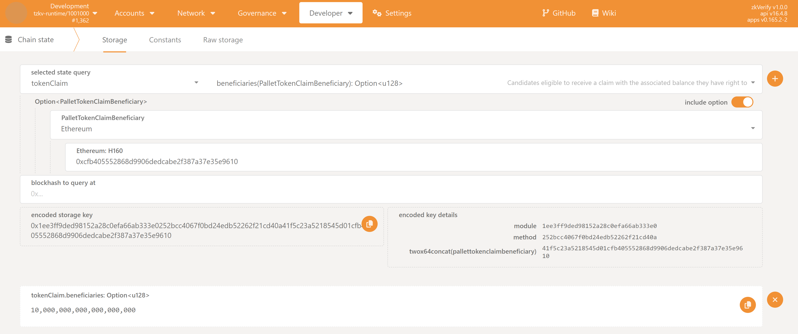
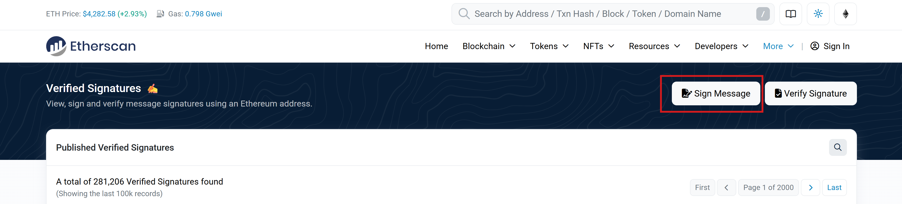
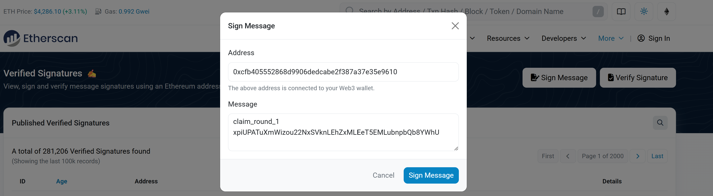
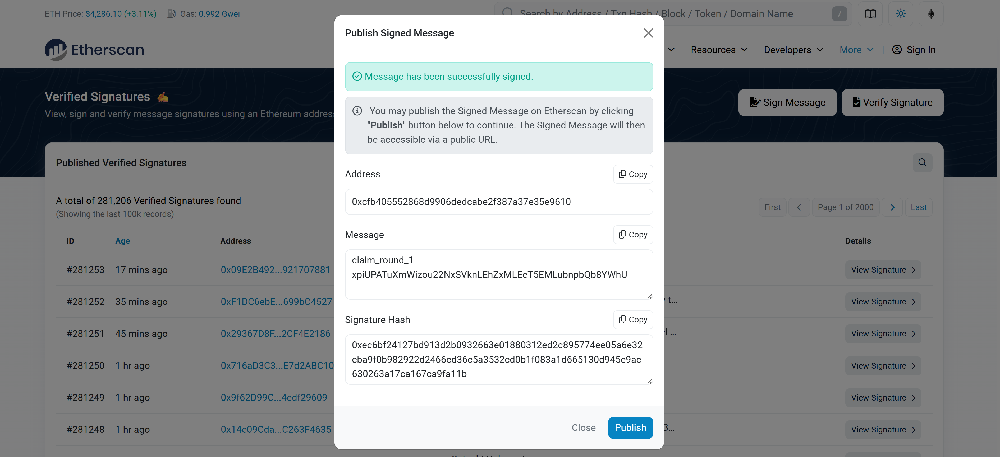
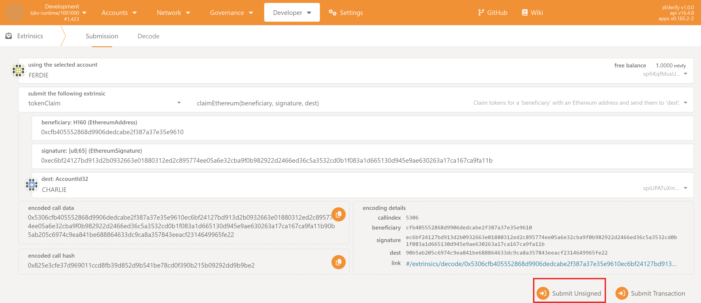

This guide will walk you through the process of claiming your tokens if your Ethereum address was included as a beneficiary.
The process for Ethereum users requires to provide a Substrate-based address where beneficiaries want to receive the tokens. 
The claiming process is **feeless** and is done by submitting an unsigned transaction to the `tokenClaim` with a valid Ethereum signature.

### Prerequisites

1.  **Claim is active**: The claim has been officially initiated. You can check this in the following way:
    1.  Navigate to the **PolkadotJS Apps** interface for our chain.
    2.  Navigate to **Developer > Chain state** tab.
    3.  Select the `tokenClaim` module and the `claimActive: bool` method.
    4.  Click on the `+` button on the right. If the claim has started `true` will be returned, `false` otherwise.
   


2.  **Access to Your Ethereum Wallet:** You have access to the eligible Ethereum wallet (e.g., via MetaMask).
3.  **Access to Your Substrate Account:** You must have a Substrate account to receive the tokens. If you don't have one, follow [this guide](../../overview/02-getting-started/01-connect-a-wallet.md).
   
4.  **Eligibility:** You have confirmed that your Ethereum address is on the list of beneficiaries for the current giveaway. You can easily check if you are eligible in this way:
    1.  Navigate to the **PolkadotJS Apps** interface for our chain.
    2.  Navigate to **Developer > Chain state** tab.
    3.  Select the `tokenClaim` module and the `beneficiaries(PalletTokenClaimBeneficiary): Option<u128>` method. Make sure also to check the `include option` button on the right.
    4.  From the new fields that show up, set:
        1.  `PalletTokenClaimBeneficiary` to `Ethereum`
        2.  `Ethereum: H160` to your Ethereum address.
        3.  Leave the `blockhash to query at` field empty.
    5.  Click on the `+` button on the right. If you are eligible, you should see returned the amount you are entitled to (with 18 decimals), otherwise `<none>` will be returned.



5.  **Official Claiming Message:** The project team will announce an official, unique "claiming message" when the giveaway period begins. You will need this exact string of text. 
    You can get is as well on-chain in the following way:
    1.  Navigate to the **PolkadotJS Apps** interface for our chain.
    2.  Navigate to **Developer > Chain state** tab.
    3.  Select the `tokenClaim` module and the `claimId: Option<(u64, Bytes)>` method.
    4.  Click on the `+` button on the right. A number and a message will be returned between square brackets `[]`. Copy only the message.


### Step 1: Construct the Special Message to Sign

For security, you must sign a special message that includes both the claiming message and the chosen Substrate destination address.

The format is:
`[claiming_message]@[destination_address]`

**Example:**
*   Claiming Message: `claim_round_1`
*   Destination Address: `ZKXEFgKUrjavy6PEBPrqwNY6svCkz72ttwP77JApnjXKWNVb6`

The final message you need to sign is:

```bash
claim_round_1@ZKXEFgKUrjavy6PEBPrqwNY6svCkz72ttwP77JApnjXKWNVb6
```

:::warning
Be very careful to construct this string exactly.
Make sure there aren't unwanted characters (e.g. whitespaces, newlines, etc.) at the beginning or at the end of the message, nor in between the claim message and the address.
:::

### Step 2: Generate Your Ethereum Signature

You will sign the message constructed in Step 1 with your **eligible Ethereum account**. You can use a trusted tool like Etherscan's message signing tool.

**Using Etherscan:**
1.  Go to the [Etherscan](https://etherscan.io/verifiedSignatures#)'s Verified Signature tool.



:::note
Most of the EVM-based Blockchains leveraging a `_scan` explorer (e.g. [Basescan](https://basescan.org/verifiedSignatures) for Base), has this tool
:::

2.  Click on `Sign Message` and connect the Ethereum Wallet and the corresponding eligible Ethereum account.
3.  In the `Message` box, paste the **full constructed message** from Step 1.



:::warning
Be very careful to paste the message to sign exactly as you constructed it in Step 1.
Make sure there aren't unwanted characters (e.g. whitespaces, newlines, etc.) at the beginning or at the end of the message, nor in between the claim message and the address.
The easiest way is to write it directly in the Etherscan `Message` box.
:::

4.  Click `Sign Message`. Your wallet will prompt you a confirmation to sign the message.
5.  After signing, copy the value of the `Signature Hash` field. This is the Ethereum signature you're going to use for claiming on zkVerify, and it will start with `0x...`.



:::warning
Please use only official Ethereum tooling to construct this signature. The message to be signed needs to follow a specific format, as specified by [EIP-191](https://eips.ethereum.org/EIPS/eip-191).
Attempts to manually craft the message and the signature might result in a failed claim on zkVerify. 
:::

### Step 3: Submit the Claim Transaction

Now that you have the signature, you will submit it to the chain using an unsigned extrinsic.

1.  On the PolkadotJS Apps interface, navigate to **Developer > Extrinsics**.
2.  Select the `tokenClaim` module from the first dropdown and the `claimEthereum(beneficiary, signature, dest)` method in the second dropdown.
3.  For the `beneficiary: H160 (EthereumAddress)` field, paste your Ethereum Address
4.  For the `signature: [u8;65] (EthereumSignature)` field, paste the signature you copied in Step 2.
5.  For the `dest: AccountId32` field, insert the Substrate address on which you want to receive the tokens (e.g. `ZKY..`, `xpi..`).
6.  Click the **"Submit Unsigned"** button and the **Submit (no signature)** button in the new window that will appear.



### Step 4: Verify Your Claim
If the signature and address are valid, the transaction will be processed, and a green checkmark `ExtrinsicSuccess` will appear at the top of your screen.
You can verify the claim was successful by checking your chosen Substrate account (`dest`) balance on the **Accounts** page, or by verifying that your Ethereum address
is not present anymore in the beneficiaries list.

### Troubleshooting
If the transaction fails, you will see a red sign on top of your screen and an `InvalidTransaction` error message if you hover over it. The possible errors are:

- `Transaction is outdated`: There is no active claim at the time the transaction was submitted.
- `Invalid signing address`: The Ethereum address you are trying to claim for is not on the beneficiary list.
- `Transaction has a bad signature`: The signature on the message is not verified. Either the signature is malformed
  (e.g. the wrong message was signed) or the signature has not been produced by the expected claimant address. 
