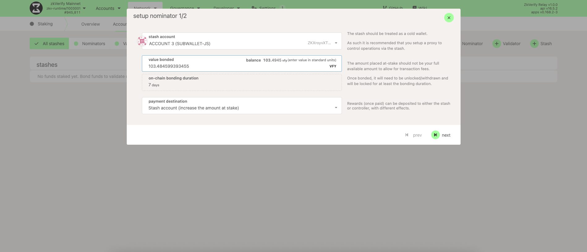
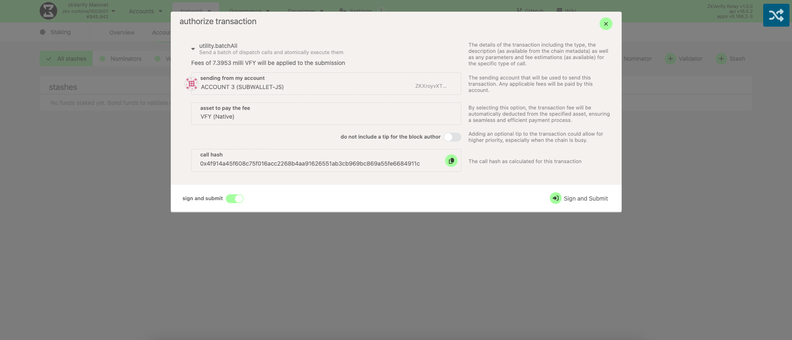

You can stake VFY using two options: SubWallet or PolkadotJS.

### Option 1: Staking with SubWallet (recommended)

For the most retail-friendly flow, use the SubWallet browser extension. You can nominate validators directly inside the wallet without leaving the UI.

[SubWallet has a full step-by-step guide that walks you through:](https://docs.subwallet.app/main/extension-user-guide/earning/direct-nomination/start-staking)

- Choosing the right validator set
- Bonding your tokens
- Monitoring rewards and payouts

We suggest following their guide for the smoothest experience.

[Watch our video on staking with SubWallet.](https://youtu.be/cBQUoEzr3ZM)

### Option 2: Staking with PolkadotJS (advanced)

Head to [PolkadotJS](https://polkadot.js.org/apps/?rpc=wss%3A%2F%2Fzkverify-volta-rpc.zkverify.io#/explorer) and navigate to `Network → Staking → Accounts`. PolkadotJS is the standard interface for Substrate chains, including zkVerify. Select `+ Nominator` to begin.

Choose the nominator account, enter how much VFY you want to stake, and pick where rewards should go (payout account). Bonding locks the tokens as stake; they remain yours but cannot be transferred until unbonded. After filling in the fields, click `Next`.

You'll see the list of active and waiting validators. Select the validators you trust—if a validator is slashed, nominators can lose funds. It's best to pick multiple validators to distribute risk and improve inclusion chances. When you're ready, click `Bond & Nominate`.

Finally, click `Sign and Submit` to complete your nominations.

:::warning
You currently need to stake a minimum of **10 VFY** to become a nominator. To confirm the latest value, visit `Developer → Chain State → staking → minNominatorBond` and press the `+` button.
:::

