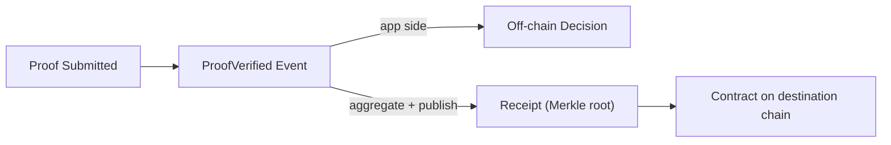

zkVerify has two modes: verify-only and verify + aggregate. We’ll describe each path first, then compare the boundary.

The core of verify-only is “results stay on the application side.” After a proof passes verification on zkVerify, a `ProofVerified` event is emitted. Your system can consume this result to drive permissions, settlement, or audits without publishing anything to a destination chain. Engineering-wise, the focus is: you only need verification to succeed; you don’t take on on-chain consumption dependencies.

The core of verify + aggregate is “results must be trusted by on-chain contracts.” After verification, proofs enter aggregation, a receipt (Merkle root) is produced, and a relayer publishes it to a destination-chain contract. The contract consumes the receipt, not the proof itself. This path turns verification results into chain-addressable data.

The difference is only one thing: who consumes the result. App-side consumption stops at `ProofVerified`. On-chain consumption requires receipt publication.

A zkVerify receipt is the Merkle root of verified proofs. It matters because contracts won’t re-run full verification; they read receipts to confirm the result came from zkVerify. This difference defines your system boundary: do you consume the verification signal in the app, or consume aggregated results on-chain?

VFlow is a zkVerify system parachain for the EVM ecosystem, bridging VFY to EVM chains. It is not mandatory, but it explains why many EVM scenarios choose verify + aggregate: the final consumer is on-chain.



Here is a minimal handling sketch that highlights the “event-driven” branch and whether you enter receipt publication:

```text
on ProofVerified(statement):
  if consumer_is_onchain:
    wait for receipt published by relayer
    contract consumes receipt
  else:
    handle result in application
```

The most common pitfall is treating “verified” as “on-chain usable.” The symptom is: proof verified, but the contract has nothing to verify. Cause: you never entered the receipt publication path. Fix: decide whether the consumer is on-chain before choosing verify-only vs verify + aggregate.
