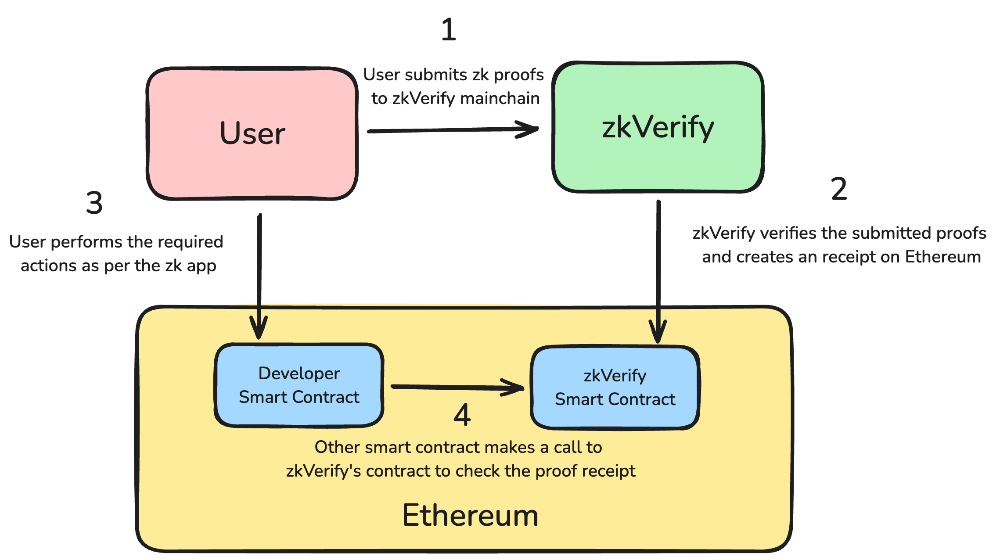

# User Workflow with zkVerify



1. The user submits a zk proof using our submitProof extrinsic for respective supported verification pallets. We need to create a leaf value for our proof, to do so we need to find the following:- 
    ```rust
    leaf_digest = keccak256(keccak256(verifier_ctx), hash(vk), keccak256(public_inputs_bytes))
    ```

2. Once the proof is submitted, we need the proof to be finalized on which Poe::NewElement event is emitted by the chain which contains the attestaion_id for our proof receipt.

3. Still, to verify our proof receipt on Ethereum we need to wait for Poe::NewAttestation event to be emitted for our proof receipt. After this, we can get the Merkle path for our proof receipt through the poe_proofPath extrinsic.

4. Finally, we can submit our attestation_id and Merkle proof using the verifyProofAttestation function on the zkVerify contract on Ethereum to verify the proof receipt.


