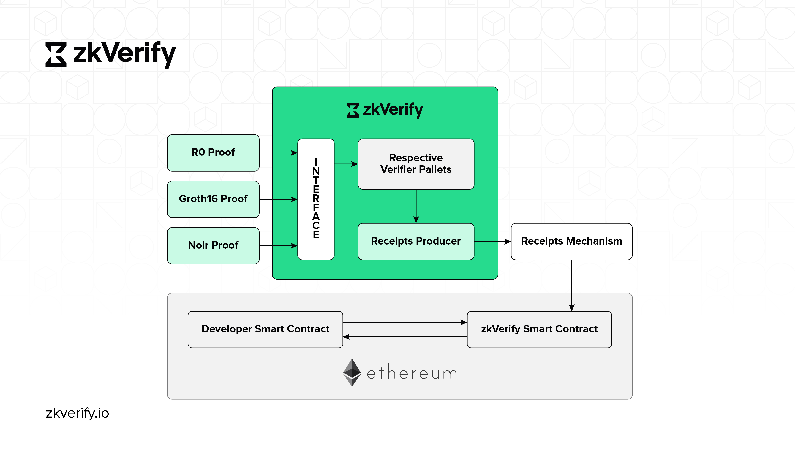

# zkVerify Architecture

## Core Blockchain

Our chain is an L1 proof of stake blockchain built on the Substrate chain. This chain is specialized to verify zk proofs with built-in verifier pallets to verify a variety of zk proofs. ACME is the primary token for our chain and to verify proofs on our chain you will need ACME.

## Proof Submission Interface

This is the entry point for our mainchain, where users will be submitting transactions and making RPC calls. Similar to any other blockchain we have multiple implementations that you can use to interact with our interface including zkVerifyjs. This library makes it very easy for developers to interact with the mainchain with simple code snippets to register a verification proof, submit a zk proof, listen to events, get attestation details, etc.

## Proof Receipt Mechanism

After the proof verification requests are fulfilled by our chain and added to its block, it passes through the attestation mechanism to generate a proof receipt for the verified proof. These proof receipts are the Merkle tree of all the verified proofs for the given batch. These proof receipts are published on a smart contract on Ethereum when 2/3rd of validators agree to these receipts.

## Aggregation Engine

The aggregation proofs system is designed to be permission less and everyone can participate in this step by publishing the aggregation and get some fee by doing this job. It's possible to define several aggregation domains and each domain has its own aggregation size: when a user needs to verify a proof can choose in which domain his proof should be aggregated.

## OnChain Verification

User submits Merkle proof for their attestation to the contract where the attestations were published. These Merkle proofs are then verified to check if the given proof was actually verified through zkVerify. Currently, our contracts are deployed on the following chains:-

- Sepolia Testnet
- Arbitrum Sepolia Testnet
- Curtis (ApeChain Testnet)
- Gobi (EON Testnet)
- EDU Chain Testnet

## Verifier Pallets

We have created built-in verifier pallets for different proving schemas to support a wide variety of zk proofs on our mainchain. The proof submission interface passes the proof verification requests to respective verifier pallets which verify these proofs and add them to the block. Currently, we support :- 
- Fflonk
- Groth16
- Ultraplonk(Noir)
- Risc Zero
- Sxt Proof of SQL

