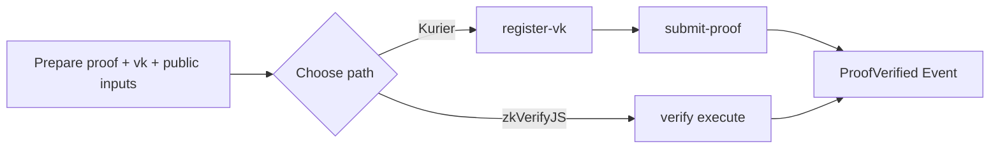

This section does one thing: get a proof into zkVerify and see a “verification completed” result. You can take either path: Kurier (REST API) or zkVerifyJS (direct chain interaction). The choice isn’t critical here — the goal is to make the loop work.

To avoid getting stuck on setup, we keep only the required steps. You need three things: proof, vk, and public inputs. The Kurier path registers vk first; the zkVerifyJS path submits verification directly on-chain.



## Path A: Kurier (REST API)

Kurier requires an API key. Obtain a key and put it in `.env`.

```text
API_KEY=your_kurier_api_key
```

Minimal vk registration payload (groth16 example):

```ts
const regParams = {
  proofType: "groth16",
  proofOptions: { library: "snarkjs", curve: "bn128" },
  vk: key
}
const regResponse = await axios.post(`${API_URL}/register-vk/${process.env.API_KEY}`, regParams)
```

Minimal proof submission payload (ultrahonk example):

```ts
const params = {
  proofType: "ultrahonk",
  vkRegistered: true,
  chainId: 11155111,
  proofData: {
    proof: proof.proof,
    publicSignals: proof.pub_inputs,
    vk: vk.vkHash || vk.meta.vkHash
  }
}
const requestResponse = await axios.post(`${API_URL}/submit-proof/${process.env.API_KEY}`, params)
```

After submission, poll job-status until `Finalized`:

```ts
const jobStatusResponse = await axios.get(
  `${API_URL}/job-status/${process.env.API_KEY}/${requestResponse.data.jobId}`
)
if (jobStatusResponse.data.status === "Finalized") {
  // verified
}
```

## Path B: zkVerifyJS (direct chain interaction)

zkVerifyJS needs a seed phrase to sign transactions, and the account must have tVFY for fees.

```text
SEED_PHRASE="this is my seed phrase i should not share it with anyone"
```

Start a session and submit a verification request:

```ts
const session = await zkVerifySession.start().Volta().withAccount(process.env.SEED_PHRASE)
await session.verify()
  .groth16({ library: Library.snarkjs, curve: CurveType.bn128 })
  .execute({
    proofData: { vk: key, proof: proof, publicSignals: publicInputs },
    domainId: 0
  })
```

## Common blockers

The most common issue is passing vk or public inputs in the wrong format, so no verification result ever appears. In the Kurier path, confirm that `register-vk` returns a vk hash before submitting proof. In the zkVerifyJS path, confirm the account has tVFY; otherwise the chain won’t accept the transaction.
