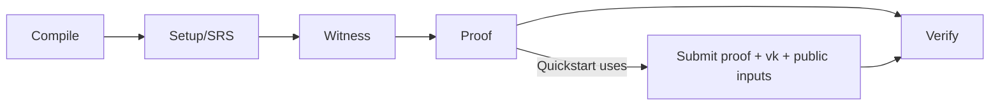

This page doesn’t re-teach concepts. It translates the Quickstart actions into “what actually happened in the system.” The flow you just ran covers only a slice of the full lifecycle, but it’s enough for engineering decisions.

First, what steps actually occurred? You prepared proof, vk, and public inputs, then submitted them to zkVerify. Once on-chain verification succeeded, it emitted `ProofVerified` — the “verification success” you saw in Quickstart. In lifecycle terms, this corresponds to the “Proof” and “Verify” stages. Compile, setup, and witness happened inside your proving toolchain, but Quickstart didn’t expand them.

This diagram aligns Quickstart with the full lifecycle:

Now map the roles. The Producer writes the circuit/program and defines where vk comes from — that work is done before Quickstart. The Prover generates the proof, usually on the client/user side. The Verifier is zkVerify: it receives proof, vk, and public inputs, and emits `ProofVerified` on success.

A simple responsibility table helps keep the roles straight:

| 角色 | 负责什么 | Quickstart 里在哪出现 |
| --- | --- | --- |
| Producer | 定义电路/程序与 vk | 在你准备 vk 时隐含出现 |
| Prover | 生成 proof | 在你提交 proof 前完成 |
| Verifier | 验证 proof | zkVerify 上触发 `ProofVerified` |

The most common confusion is treating zkVerify as a Prover. The symptom is looking for “proof generation APIs.” The fix is simple: zkVerify only verifies, it does not generate proofs.

The next chapter will explain what happens before proof generation and after verification so you can place Quickstart inside the full system.
