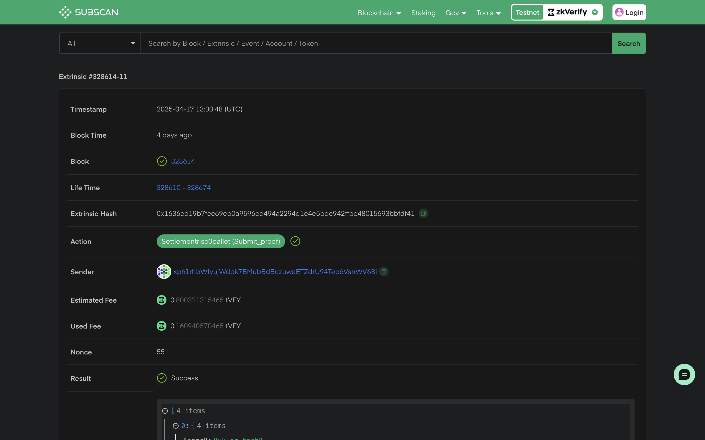
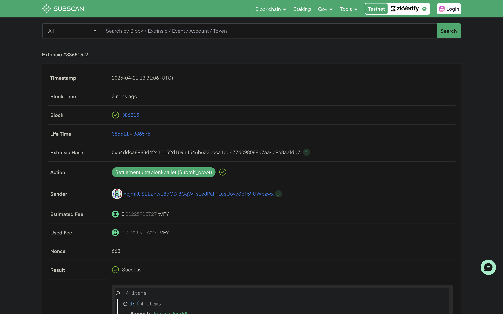

import Tabs from '@theme/Tabs';
import TabItem from '@theme/TabItem';

:::info
All the codebase used in the tutorial can be explored [here](https://github.com/zkVerify/tutorials/tree/main/zkVerifyJS)
:::

In this tutorial we will be verifying proofs using zkVerify JS package. ```zkVerify JS``` is a NPM package which makes it very easy to submit proofs, listen events and get aggregation proofs. You can use this package with all the proof types we support.

:::note
Before starting the tutorial make sure to update your Node JS to the latest version (v24.1.0)
You can check your Node JS version with command ``node -v``
:::

Let's create a new project and install ```zkverify JS``` for our project. Run the following commands:

Create a new directory:
```bash
mkdir proof-submission
```
Navigate to the project directory:
```bash
cd proof-submission
```
Initialise an NPM project:
```bash
npm init -y && npm pkg set type=module
```
Install zkVerify JS and dotenv:
```bash
npm i zkverifyjs dotenv
```

Let's create a ``.env`` file to store our ``SEED PHRASE``, which will be used later to send proofs for verification to zkVerify. Use the following code snippet to fill up your ``.env`` file.
```bash
SEED_PHRASE = "this is my seed phrase i should not share it with anyone"
```

Create a new file named ```index.js``` to write the verification logic. Open ```index.js``` in your IDE and import the following components from ```zkVerify JS``` and ``dotenv`` :

<Tabs groupId="import">
<TabItem value="circom" label="Circom">
```js
import { zkVerifySession, Library, CurveType, ZkVerifyEvents } from "zkverifyjs";
import dotenv from 'dotenv';
dotenv.config();
```
</TabItem>
<TabItem value="r0" label="Risc Zero">
```js
import { zkVerifySession, ZkVerifyEvents, Risc0Version } from "zkverifyjs";
import dotenv from 'dotenv';
dotenv.config();
```
</TabItem>
<TabItem value="noir" label="Noir">
```js
import { zkVerifySession, ZkVerifyEvents } from "zkverifyjs";
import dotenv from 'dotenv';
dotenv.config();
```
</TabItem>
</Tabs>

We would also need to import the required files we have generated already in previous tutorials, which are proof, verification key and public inputs. Use the following code snippets :

<Tabs groupId="import-files">
<TabItem value="circom" label="Circom">
```js
import fs from "fs";
const proof = JSON.parse(fs.readFileSync("./data/proof.json"));
const publicInputs = JSON.parse(fs.readFileSync("./data/public.json"));
const key = JSON.parse(fs.readFileSync("./data/main.groth16.vkey.json"));
```
</TabItem>
<TabItem value="r0" label="Risc Zero">
```js
import fs from "fs";
const proof = JSON.parse(fs.readFileSync("../my_project/proof.json")); // Following the Risc Zero tutorial
```
</TabItem>
<TabItem value="noir" label="Noir">
```js
import fs from "fs";
const bufvk = fs.readFileSync("../target/vk");
const bufproof = fs.readFileSync("../target/proof");
const base64Proof = bufproof.toString("base64");
const base64Vk = bufvk.toString("base64");
```
</TabItem>
</Tabs>

:::info
Next we will be writing the core logic to send proofs to zkVerify for verification.
All the following code snippets should be inserted within async main function.
```js
async function main(){
  // Required code
}

main();
```
:::

Once you have all the requirements imported, we will start by instantiating a session with our Volta testnet with an account(This account should have $tVFY to pay for transactions). 
```js
const session = await zkVerifySession.start().Volta().withAccount(process.env.SEED_PHRASE);
```

Next we will send a proof verification request to the Volta testnet, with all the details like which proving schema, proof, public signals and the key. We will also need to specify the ``domainId`` for which we want this proof to be aggregated. You can check more about Domain and Aggregation [here](../../architecture/04-proof-aggregation/01-overview.md). For this tutorial, choose the Domain ID based on the target chain where you want to verify the attestations [List of existing domains](../../architecture/04-proof-aggregation/05-domain-management.md). We will also create an event listener, to listen to the ``NewAggregationReceipt`` event whenever our proof is aggregated : 

<Tabs groupId="proof-verification">
<TabItem value="groth16" label="Circom">
```js
let statement, aggregationId;


session.subscribe([
  {
    event: ZkVerifyEvents.NewAggregationReceipt,
    callback: async (eventData) => {
      console.log("New aggregation receipt:", eventData);
      if(aggregationId == parseInt(eventData.data.aggregationId.replace(/,/g, ''))){
        let statementpath = await session.getAggregateStatementPath(
          eventData.blockHash,
          parseInt(eventData.data.domainId),
          parseInt(eventData.data.aggregationId.replace(/,/g, '')),
          statement
        );
        console.log("Statement path:", statementpath);
        const statementproof = {
          ...statementpath,
          domainId: parseInt(eventData.data.domainId),
          aggregationId: parseInt(eventData.data.aggregationId.replace(/,/g, '')),
        };
        fs.writeFileSync("aggregation.json", JSON.stringify(statementproof));
    }
    },
    options: { domainId: 0 },
  },
]);

const {events} = await session.verify()
.groth16({library: Library.snarkjs, curve: CurveType.bn128})
.execute({proofData: {
    vk: key,
    proof: proof,
    publicSignals: publicInputs
}, domainId: 0});
```
</TabItem>
<TabItem value="r0" label="Risc Zero">
```js
let statement, aggregationId;
session.subscribe([
  {
    event: ZkVerifyEvents.NewAggregationReceipt,
    callback: async (eventData) => {
      console.log("New aggregation receipt:", eventData);
      if(aggregationId == parseInt(eventData.data.aggregationId.replace(/,/g, ''))){
        let statementpath = await session.getAggregateStatementPath(
          eventData.blockHash,
          parseInt(eventData.data.domainId),
          parseInt(eventData.data.aggregationId.replace(/,/g, '')),
          statement
        );
        console.log("Statement path:", statementpath);
        const statementproof = {
          ...statementpath,
          domainId: parseInt(eventData.data.domainId),
          aggregationId: parseInt(eventData.data.aggregationId.replace(/,/g, '')),
        };
        fs.writeFileSync("aggregation.json", JSON.stringify(statementproof));
    }
    },
    options: { domainId: 0 },
  },
]);

const {events} = await session.verify().risc0({ version: Risc0Version.V1_2} ) // Mention the R0 version used while proving
.execute({proofData:{
    proof: proof.proof,
    vk: proof.image_id,
    publicSignals: proof.pub_inputs,
}, domainId: 0})
```
</TabItem>
<TabItem value="noir" label="Noir">
```js
let statement, aggregationId;

session.subscribe([
  {
    event: ZkVerifyEvents.NewAggregationReceipt,
    callback: async (eventData) => {
      console.log("New aggregation receipt:", eventData);
      if(aggregationId == parseInt(eventData.data.aggregationId.replace(/,/g, ''))){
        let statementpath = await session.getAggregateStatementPath(
          eventData.blockHash,
          parseInt(eventData.data.domainId),
          parseInt(eventData.data.aggregationId.replace(/,/g, '')),
          statement
        );
        console.log("Statement path:", statementpath);
        const statementproof = {
          ...statementpath,
          domainId: parseInt(eventData.data.domainId),
          aggregationId: parseInt(eventData.data.aggregationId.replace(/,/g, '')),
        };
        fs.writeFileSync("aggregation.json", JSON.stringify(statementproof));
    }
    },
    options: { domainId: 0 },
  },
]);

const {events} = await session.verify()
    .ultraplonk({numberOfPublicInputs: 2}) // Make sure to replace the numberOfPublicInputs field as per your circuit 
    .execute({proofData: {
        vk: base64Vk,
        proof: base64Proof,
    }, domainId: 0});
```
</TabItem>
</Tabs>

We can listen to events to get the current status of our submitted proof, and collect important data required for attestation verification. We have custom events for block inclusion, transaction finalization, etc. You can listen to them using our events.on() function like : 
```js
events.on(ZkVerifyEvents.IncludedInBlock, (eventData) => {
    console.log("Included in block", eventData);
    statement = eventData.statement;
    aggregationId = eventData.aggregationId;
})
```

Now you can run this script using the command ``node index.js``. After running the script a new file named ``aggregation.json`` would have been created, which has the all the details required to verify the aggregation on the target chain. You would find something like the following:
```json
{
  "root": "0xef4752160e8d7ccbc254a87f71256990f2fcd8173e15a592f7ccc7e130aa5ab0",
  "proof": [
    "0x40fbf21f1990ef8d1425d12ec550176fe848a7c63f0c59f7a48101e51c9aceee",
    "0x0be311c3643fb3fcd2b59bf4cfd02bdef943caf78f92d94a080659468c38fef9",
    "0x2117831ac2000ccdbb51f5deef96d215961ca42920a9196259e8b6e91b9fef53"
  ],
  "numberOfLeaves": 8,
  "leafIndex": 0,
  "leaf": "0xc5a8389b231522aad8360d940eb3ce275f0446bba1a9bd188b31d1c7dd37f136",
  "domainId": 0,
  "aggregationId": 137
}

```

You can check details about the verified proofs using the ``txHash`` on our [zkVerify explorer](https://zkverify-testnet.subscan.io/).

<Tabs groupId="explorer">
<TabItem value="circom" label="Circom">

</TabItem>
<TabItem value="r0" label="Risc Zero">

</TabItem>
<TabItem value="noir" label="Noir">

</TabItem>
</Tabs>

By running the above code snippet, your attestation proof will be saved at attestation.json file. After completing this process, we have successfully verified our proof with zkVerify and the next steps will be to use this attestation proof for our business logic onchain. Next we will be verifying the proof reciepts through a smart contract. You can check this [tutorial](./08-smart-contract.md) to understand more about the smart contract verification part.

