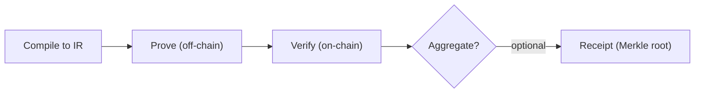

The value of this chapter is not memorizing terms, but knowing “which segment is broken” when you troubleshoot. Proof generation, verification, aggregation, and on-chain consumption often get mixed together, and you end up fixing the wrong part. Once the lifecycle is straightened out, boundaries become clear.

Think of it like a package sorting line: each station does one step, and the output of one station is the input of the next. You don’t need to control the whole line, but you must know which segment you own and where the handoff is.

System facts: proof generation happens off-chain, while verification usually happens on-chain. The generation process includes “compile to intermediate representation → produce proof offline.” Verification is on-chain and typically much faster than proving. That’s why Quickstart showed verification but not compile or witness.

Whether the next step enters aggregation is an engineering choice. Aggregation is optional and primarily used to amortize cost; if your consumer is off-chain, you can stop at verification results and skip receipt publication.

The report treats prover, verifier, and witness as core components of a ZKP system. You’ll keep seeing these names in toolchains, APIs, and logs. They map to “proof generation,” “proof verification,” and “input material used to build the proof.”

| Component | Where it appears | Where you see it in practice |
| --- | --- | --- |
| Prover | Proof generation | When running the proving toolchain |
| Verifier | Proof verification | On-chain verification or zkVerify verification |
| Witness | Proof generation | When preparing input materials |

> 📌 Note: Aggregation is optional. Its purpose is not “more correct,” but cheaper.

The next two sections break down roles and the five-step pipeline so you can align “who owns what” and “what the previous output was.”
