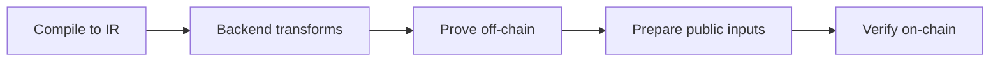

The value of these five steps is troubleshooting. Treat it like an assembly line: proofs are produced off-chain, then verified on-chain. If you know where each artifact comes from, you can tell whether a failure is in compile, prove, or verify.

In ZK systems, proof generation happens off-chain while verification usually happens on-chain. Proofs are not produced “directly from code.” The program is compiled into an intermediate representation, then goes through backend transforms like polynomial conversion, commitments, and Fiat‑Shamir before a proof is produced. This means you will face both local computation issues and on-chain verification issues in engineering.

Here is a pipeline diagram from an engineering perspective:



Break the line into five actions you will actually encounter:

1) Compile: compile circuit/program into IR (r1cs/wasm or acir). Without this, nothing downstream has inputs.
2) Setup/SRS: some systems require setup or SRS to produce pk/vk. vk carries into verification.
3) Witness: assemble private inputs and generate witness, the raw material for proof.
4) Proof: produce proof from compile artifacts + witness, and generate public inputs.
5) Verify: use vk + proof + public inputs to produce a verification result.

Minimal “verification input assembly” sketch to show why public inputs and vk must match:

```text
statement = keccak256(
  keccak256(verifier_ctx),
  hash(vk),
  version_hash(proof),
  keccak256(public_inputs_bytes)
)
```

An engineering analogy is “factory QA”: Compile/Setup/Witness/Proof are production steps, Verify is the QA line. If QA fails, don’t change QA rules first—check whether the production line changed (for example, vk and proof from different compile outputs).

> ⚠️ Warning: The most common reason for verification failure is not on-chain logic, but vk/proof/public inputs coming from different compile outputs.

Final tip: slow proof generation is usually Step 3/4, while slow verification is Step 5. Separate these stages to pinpoint performance bottlenecks.
