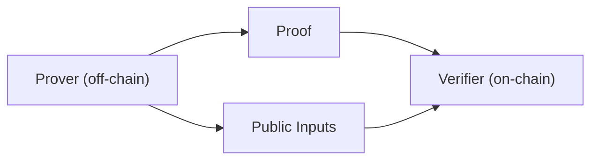

If you’re new to ZK, this path is not about memorizing terms. It is about building a usable engineering intuition: proofs are produced off-chain, verification usually happens on-chain, and what matters most is system boundaries, data flow, and where to locate failures — not math details.

The core properties of ZK are often stated as zero-knowledge, completeness, and soundness. For engineers, this means two things: proofs can be verified without revealing inputs, and verification results are repeatable inside a system. You don’t need formal definitions here, but you must treat these as hard constraints for design choices later.

The three most fundamental pieces in a ZK system are prover, verifier, and witness. They are not just roles—they are three responsibility links: who generates the proof, who verifies it, and where the proof’s input material lives. You will see these in toolchains, APIs, and logs regardless of the framework you use.



This path assumes non‑interactive proofs, because multi‑round interaction is expensive and impractical on blockchains. Non‑interactive means you package the proving process into a one‑shot verifiable bundle: proof + public inputs. You’ll see later that zkVerify’s verification interfaces are built around these fields for that reason.

Proof generation usually happens off-chain, and it is not “run code, get proof.” The program is compiled into an intermediate representation, then goes through polynomial conversion, commitments, and Fiat‑Shamir before a proof is produced. Knowing this avoids a common mistake: slow proving is not chain slowness—it is local compute cost.

> 💡 Tip: If this is your first proving run, use minimal inputs to get the flow working, then optimize later. Correctness first, performance second.

Next you’ll face two trade‑offs: SNARK vs STARK, and circuit systems vs zkVMs. SNARK proofs are usually smaller and cheaper to verify, but require trusted setup; STARKs are transparent but produce larger proofs and cost more on-chain. zkVMs are more general, but have higher prover overhead and larger proofs. This is not “which is better,” but “which cost matters most to your system.”

| Choice | Engineering meaning | When you’ll encounter it |
| --- | --- | --- |
| SNARK | Smaller proofs, faster verification, trusted setup required | When on‑chain cost matters most |
| STARK | Transparent setup, larger proofs, higher verification cost | When you want to avoid trusted ceremonies |
| zkVM | More general, higher prover overhead, larger proofs | When you want to reuse existing program logic |

This path uses one consistent example across later concept pages so you don’t have to switch context. You’ll see commitment, Merkle tree, witness, and public inputs working in one story line rather than isolated pages.

```text
proof = Prove(compile_artifacts, witness)
public_inputs = ExtractPublicInputs(witness)
```

Once you move into zkVerify, you’ll face an extra choice: do you need aggregation? It is optional and mainly amortizes verification cost by turning multiple proofs into a single consumable result. For now, just remember it is optional; when it’s required is covered later.

> ⚠️ Warning: Don’t mix proof generation and verification. Generation is off‑chain, verification is on‑chain — this boundary underlies all system design.

This section builds a beginner‑friendly intuition. The next section starts with minimal concepts and places these terms into a runnable engineering scenario using one consistent example.
