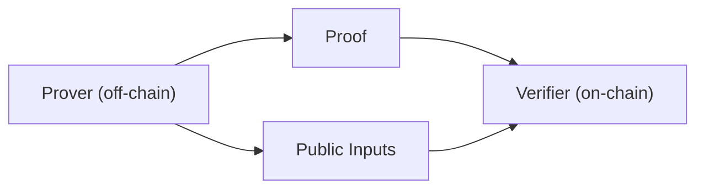

如果你刚接触 ZK，这一条路径的目标不是让你背术语，而是先建立一个“工程可用的直觉”：证明是链下产出的，验证通常在链上发生；你关心的是系统边界、数据走向和失败时的定位点，而不是数学细节。

ZKP 的基本属性常被写成三句话：零知识、完备性、可靠性。对工程师来说，它们意味着两件事：证明可以在不泄露输入的情况下被验证，且验证结果在系统里有可重复性。你不需要在这里深入形式化定义，但要知道这三项是后续所有设计选择的硬约束。

ZK 系统里最核心的三件东西是 prover、verifier 和 witness。它们不是角色名词，而是三段实际责任链：谁生成证明、谁验证证明、证明所依赖的输入材料在哪里。你在工程里会频繁遇到它们，不管你用的是哪种库或框架。



这条路径默认使用“非交互式证明”，因为区块链环境里多轮交互太贵且难以落地。非交互意味着你要把证明过程打包成一次性可验证的数据包：proof + public inputs。你会在后面章节看到，这也是 zkVerify 的验证接口为什么总是围绕这些字段展开。

proof 生成通常发生在链下，而且不是“把代码一跑就出 proof”。它先把程序编译成中间表示，然后在后台经历多项式转换、承诺和 Fiat‑Shamir 等步骤，最后才产出 proof。理解这一点可以帮你避免一个常见误判：proof 生成慢不等于链慢，它往往是本地 proving 的计算瓶颈。

> 💡 Tip: 如果你第一次跑 proving，先用最小输入跑通流程，再去优化性能。先确认流程正确比盯着速度更重要。

接下来你会遇到两个方向上的权衡：SNARK 与 STARK、以及电路系统与 zkVM。SNARK 通常 proof 更小、验证更快，但需要可信 setup；STARK 透明但 proof 更大、链上验证成本更高。zkVM 更通用，但 prover 开销更高、proof 体积也更大。这些不是“选哪个好”的问题，而是“你的系统更在意哪一类成本”的问题。

| 选择 | 工程含义 | 你会在什么时候遇到 |
| --- | --- | --- |
| SNARK | proof 更小、验证更快，但需要可信 setup | 追求链上成本最低时 |
| STARK | 透明 setup，但 proof 更大、验证更贵 | 不希望依赖可信仪式时 |
| zkVM | 更通用，但 prover 开销更高、proof 更大 | 想复用现有程序逻辑时 |

这一条路径会用同一个例子贯穿后续概念页，让你不用在不同概念间反复切换上下文。你会看到 commitment、Merkle tree、witness、public inputs 在同一条故事线里如何协作，而不是在不同页面孤立出现。

```text
proof = Prove(compile_artifacts, witness)
public_inputs = ExtractPublicInputs(witness)
```

当你进入 zkVerify 之后，还会遇到一个额外选择：是否需要聚合。聚合不是必须步骤，它主要用来摊薄验证成本、把多个 proof 变成一个可消费的结果。这里先记住“它是可选的”，具体何时需要会在后面的路径里讲。

> ⚠️ Warning: 不要把 proof 的生成和验证混成一件事。生成在链下、验证在链上，这是后面所有系统设计的前提。

这一节的作用是建立“新手也能用的直觉框架”。下一节会从最小概念开始，用一个一致的例子把这些术语放到可运行的工程场景里。
