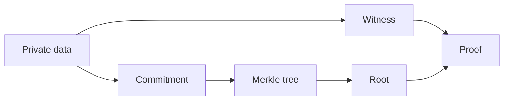

This section covers only four concepts because they form the minimum vocabulary you’ll hit in every step later. I won’t do formal math definitions here—only why they appear in engineering, when you’ll run into them, and what breaks if you get them wrong. Get these right and circuits, proofs, and on-chain verification will make sense.

**Commitment** in engineering terms means “commit now, reveal later.” You first turn data into a short commitment value, and later open it by revealing the original data. You need this because you must bind a fact on-chain or in logs without exposing the raw value. You’ll see this in identity, balances, and eligibility proofs. If you ignore it, you either leak privacy or lose a verifiable binding point.

**Merkle tree** is “batch commitment.” A single commitment binds one datum, but when you have many items, a tree lets you publish one root and use a Merkle path to prove a leaf is included. You’ll see this in batch proofs, aggregation results, and on-chain verification. The engineering value is that you don’t ship all data on-chain—one path proves membership. Ignore it and on-chain data explodes, or you fall back to single‑proof verification only.

**Poseidon** is “circuit‑friendly hashing.” Standard hashes are expensive in circuits; Poseidon is designed for circuit efficiency, so many ZK toolchains default to it. Seeing `Poseidon(...)` in a circuit or config usually means the circuit’s hash costs are under control. Ignore this and your circuit constraints blow up and proving time spikes.

**Witness** is the raw material for a proof. It includes private inputs and intermediate values and should not leave the Prover side. Proof generation commands usually output a `witness` artifact. Engineering‑wise it tells you “what the proof is actually based on,” but it must remain private. If it leaks, privacy is gone even if verification passes.

Here is a small example that places these concepts on one line. Suppose you want to prove “I belong to a list” without revealing the list:

1) Commit each identity to form leaf values.
2) Build a Merkle tree from leaves and publish the root.
3) Use Poseidon in the circuit to keep hash cost manageable.
4) Put private identity and path data in the witness, then generate the proof.



Minimal structure sketch (not code, just input/output relationships):

```text
commitment = Hash(private_data)
root = MerkleRoot(commitments[])
witness = { private_data, merkle_path }
proof = Prove(circuit, witness)
```

> 💡 Tip: If you hash inside the circuit, confirm you are using a circuit‑friendly hash, or proving time will be your first bottleneck.

> ⚠️ Warning: If witness reaches the verifier, you’ve handed over privacy. Even if verification passes, the system is no longer zero‑knowledge.

These four concepts matter not because they are “theoretically correct,” but because they define three engineering boundaries: can you batch‑verify, can you control proving cost, and can you preserve privacy. The next section uses one consistent example to show how they cooperate in one flow.
