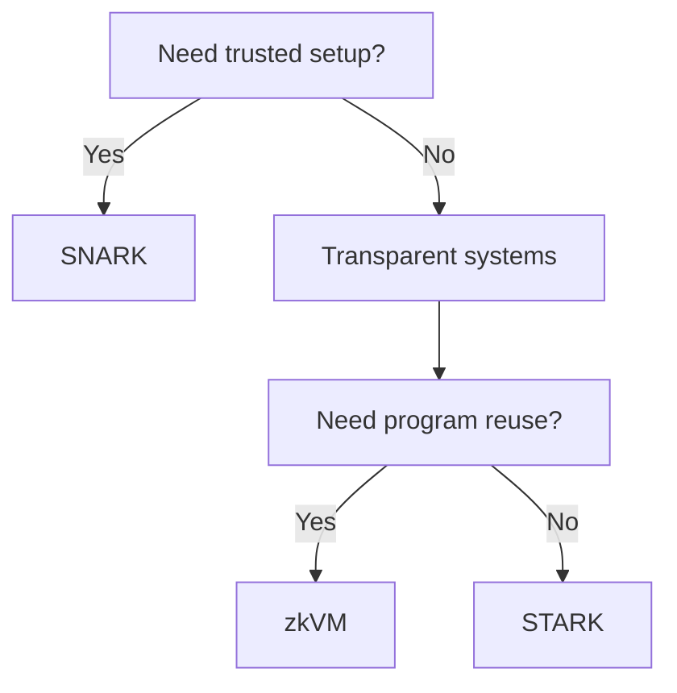

This section answers a common beginner question: **which proof system path should I choose?** No syntax here—only the engineering costs you will actually pay. You are not choosing a label, you are choosing a cost structure: proof size, verification cost, trusted setup dependency, and whether proving becomes a local bottleneck.

Start with a basic engineering premise: proof generation happens off-chain, verification happens on-chain, and verification is usually faster than proving. That means you face two cost buckets: local proving cost and on-chain verification cost. Different systems trade these costs differently.

This choice is like buying different production equipment. You don’t need full math details, but you must know that a wrong choice locks you into long-term cost. Larger proofs mean more expensive on-chain verification; heavier prover costs reduce local throughput. These are hard engineering numbers, not conceptual preferences.

First, compress the differences into a “first-pass filter.”

| Option (engineering class) | Setup model | Proof size | Verification cost | When you’ll lean toward it |
| --- | --- | --- | --- | --- |
| SNARK family | Trusted setup required | Small | Low | On-chain cost sensitive, want cheap verification |
| STARK family | Transparent (no trusted setup) | Large | High | Avoid trusted ceremonies, accept higher on-chain cost |
| zkVM | Transparent (no trusted setup) | Larger | Higher | Reuse existing program logic, accept higher prover cost |

One common mistake is “more general is always better.” zkVMs are more general, but they cost more to prove and produce larger proofs. In high‑frequency verification, that cost multiplies. If trusted setup is your bigger concern, transparent systems become more attractive. Generality is not a free benefit—it’s part of the cost structure.

Another overlooked constraint is the deployment environment. On EVM, the existing BN254 precompile limits which proof formats are practical. If you plan to consume results in EVM contracts, format and curve choices are constrained by reality, not theory. That affects whether SNARK/STARK/zkVM is actually viable for you.

Use a “factory calibration” analogy for setup:
SNARK is “calibrate then mass‑produce”—one‑time calibration cost, high output efficiency. STARK/zkVM is “produce without calibration,” but each unit costs more. You are choosing long‑term cost structure, not academic labels.

Here is a more engineering‑oriented decision path to narrow choices quickly:

1) **Can you accept trusted setup?**
   - Yes → SNARK family first.
   - No → look at STARK or zkVM.
2) **Is on‑chain verification cost your bottleneck?**
   - Yes → prefer smaller proofs and faster verification.
   - No → transparent systems may be acceptable.
3) **Do you need to reuse existing program logic?**
   - Yes → zkVM fits existing engineering habits.
   - No → circuit systems are often cheaper.

> 💡 Tip: In prototypes, don’t chase “the optimal system.” Use a familiar toolchain, get the flow working, then adjust based on real performance data.

One more overlooked point: proof aggregation is optional and exists to amortize verification cost. When proof frequency rises and on‑chain pressure grows, proof size and verification cost begin to dominate. Your choice may look similar early on, but diverges at scale.

If you’re unsure which project type you are, run a small experiment: use the same circuit/program in two systems and record proving time, proof size, and verification cost trends. Those numbers turn “engineering cost” from abstract into measurable selection criteria.

> ⚠️ Warning: Don’t let “theoretically optimal” override “engineering optimal.” In practice, constraints usually come from deployment environments, not paper metrics.

Final minimal checklist to avoid missing key questions:

- Can I accept trusted setup dependency?
- Will verification happen on-chain, and is its cost sensitive?
- Will proof generation become a throughput bottleneck?
- Do I need to reuse existing program logic?

This section helps you make a first‑pass choice based on engineering cost, not labels. The next section places these choices into concrete examples and shows how they affect proof shape and verification paths.
