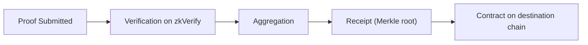

If you already understand the basics of ZK, the goal of this path is not to re-explain “what is a proof,” but to make you clear on **what happens inside zkVerify after a proof enters, and which boundaries you are responsible for**. Many engineering failures are not because “the proving algorithm is wrong,” but because teams treat the verification layer as the application layer, or treat the verification layer as the proving layer, which misplaces responsibilities and sends data down the wrong path.

Start by placing zkVerify in the system: it is a chain dedicated to verifying proofs, not a general smart contract platform. Its job is to receive proofs, verify their validity, and turn the verification results into reusable outputs. When you bring zkVerify into a project, you are essentially extracting “whether verification holds” from inside your application so it becomes a fact that multiple systems can trust.

In this path you focus on four things:

1) what happens after a proof is submitted;
2) how verification results are aggregated into reusable outputs;
3) when and how verification results are published to other systems;
4) where you, as a developer, provide inputs and where you receive results back.

The most overlooked point here is the “landing point of the verification result.” Verification finishing is only the beginning; what really determines whether you can use the result is **aggregation and publication**. zkVerify sends verified proofs into the aggregation flow, generates a receipt (Merkle root), and then a relayer publishes it to a contract on the destination chain. For on-chain consumption, the contract does not see the proof itself, but the receipt and its proof path.

You can think of zkVerify as an “acceptance center”: you hand it a proof, and it gives you a referenceable “acceptance receipt.” The receipt can be reused by other systems, but it is not the same thing as the proof. If you treat the proof as the receipt, you will get stuck when consuming on-chain.

Another point you must care about is the **cost structure**. zkVerify is on-chain verification, so every verification has a cost, and VFY is the medium that pays that cost. This means you need to consider in engineering: whether the cost per verification is acceptable, whether you need aggregation to amortize the cost, and whether you should publish the results for on-chain consumers.

There is also a choice here: use a relay API like Kurier, or interact with the chain directly. This is not about “advanced vs. basic,” but a tradeoff between engineering control and complexity. Kurier gives you a more Web2-like experience, but it also means handing off some on-chain interaction details to it.

To avoid “I understand it but can’t ship it,” you can split the process into three layers of responsibility:

- **Submission layer**: prepare the proof, vk, and public inputs, ensuring they come from the same compilation artifacts;
- **Verification layer**: let zkVerify produce reusable results;
- **Consumption layer**: decide whether results are consumed inside the application or on-chain.

This path will expand each layer into concrete mechanisms. You will see how the statement hash is formed during proof submission, what role the domain plays in aggregation, how contracts verify a receipt after publication, and at which step you should record the necessary on-chain information.

> 💡 Tip: If you can reliably generate proofs but keep getting stuck on “how to use the result,” the issue is often not proving, but whether the consumption layer has taken the aggregation and publication path.

> ⚠️ Warning: Do not treat zkVerify as a proving platform. It only handles verification, it will not generate proofs for you, and it will not decide how your business logic consumes the result.

To help you quickly locate “which layer you are in,” you can use this simplified checklist:

1) Can I reliably generate proofs and public inputs?
2) Do I get stable verification results on zkVerify?
3) Should my result stay in the application, or be used by on-chain contracts?

If you can answer these three questions, you can treat the upcoming mechanism pages as a “reference,” rather than “learning from scratch.” The next section starts with the proof submission flow and unpacks the verification layer step by step.
