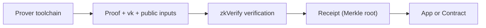

This section answers a must-clarify engineering question: **what zkVerify is responsible for, and what you must do yourself**. If you treat it as a proving platform, your system goes off track at the root; if you treat it as a normal chain, you will stumble when reusing verification results. Once you place it correctly, you can decide “which logic stays in the application and which goes to the verification layer.”

First, make the key boundary explicit: zkVerify only verifies; it does not generate proofs. Proof generation happens in your proving toolchain, usually off-chain. You prepare the proof, vk, and public inputs, submit them to zkVerify, and it returns the verification result. This is its core responsibility as a “verification layer.”

It is more intuitive to think of zkVerify as an “acceptance center”: you deliver the finished product, and it tells you “pass or fail.” The acceptance center does not manufacture for you, and it does not decide how your business uses the result. You can treat it as an “acceptance record” trusted by multiple systems.

In terms of system form, zkVerify is a Substrate-based L1 PoS chain with multiple verifier pallets built in, each supporting different proof systems. It is not a general contract platform, but infrastructure designed specifically to verify proofs. Bringing it in means “making verification an independent trusted fact,” not moving application logic on-chain.

After verification, the result does not stay inside zkVerify. It enters the aggregation flow, produces a proof receipt (Merkle root), and is published to a target-chain contract through a relayer. This means the verification layer not only gives you a “pass or fail” conclusion, but also a result carrier that on-chain systems can consume. For on-chain consumption, the contract sees the receipt, not the original proof.

To avoid confusion, here is a responsibility comparison:

| Task | zkVerify | You |
| --- | --- | --- |
| Proof generation | ✗ | ✓ |
| Proof verification | ✓ | ✗ |
| vk management | Partial (for verification) | ✓ (generation and versioning) |
| Result consumption | ✗ | ✓ |

> 📌 Note: “vk management” here refers to usage during verification. Generation and versioning are still your responsibility.

In real projects, you will hit this boundary at three moments:

1) When you submit a proof to zkVerify for the first time, you will see it does not care about your business semantics, only whether the proof is valid.
2) When you pass results to an on-chain contract, you will find the contract uses the receipt, not the proof itself.
3) When debugging, “verification failed” is usually due to proof/vk version mismatch, not on-chain logic.

A common misconception is “zkVerify can handle proving complexity for me.” In reality it only handles verification. If you make a mistake on the proving side, zkVerify only tells you verification failed, not where you generated it wrong. This is why clarifying responsibility boundaries is important.

Another, more engineering-oriented analogy: treat zkVerify as the test service in CI. It only runs tests and gives results, but it will not write your code or decide how to deploy. You can treat its result as a “test report trusted by multiple systems,” but the report does not automatically become your business decision.

If you are doing system design, the most practical approach is to split tasks into three layers:

- **Generation layer**: circuits/programs and proof generation (you)
- **Verification layer**: proof verification and result output (zkVerify)
- **Consumption layer**: how the application or contract uses the result (you)

This split helps you avoid two typical mistakes: shoving proving logic into the verification layer, which explodes cost and complexity; and treating verification results as “business complete,” ignoring that the consumption layer still has to act.

> ⚠️ Warning: Do not treat “verification success” as “business complete.” Verification is only an intermediate step; you still need to land the result in the consumption layer.

The core of this section is to put zkVerify back where it belongs: **the verification layer, not the proving layer or the business layer**. The next section starts with the proof submission flow and explains what happens inside the verification layer.
