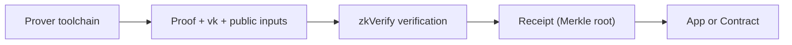

这节回答一个工程上必须先搞清楚的问题：**zkVerify 到底负责什么、哪些事情你必须自己做**。你如果把它当成 proving 平台，系统会从根上跑偏；你如果把它当成普通链，又会在验证结果的复用上踩坑。定位清楚后，你才能决定“哪些逻辑留在应用侧，哪些交给验证层”。

先把最关键的边界说清楚：zkVerify 只负责验证，不负责生成 proof。proof 的生成发生在你的 proving 工具链里，通常在链下完成。你要把 proof、vk 和 public inputs 准备好，提交给 zkVerify，它才会给出验证结果。这是它作为“验证层”的核心职责。

把 zkVerify 想成“验收中心”会更直观：你把成品送过去，它告诉你“是否合格”。验收中心不会替你生产，也不会替你决定业务怎么用结果。你可以把它当作一个能被多个系统信任的“验收记录”。

从系统形态看，zkVerify 是一条基于 Substrate 的 L1 PoS 链，链内内置多个 verifier pallets，分别支持不同证明系统。它不是通用合约平台，而是专门为验证 proof 这件事设计的基础设施。你引入它的意义是“把验证变成独立的可信事实”，而不是把应用逻辑迁到链上。

验证完成后，结果不会只停在 zkVerify 内部。它会进入聚合流程，生成 proof receipt（Merkle root），并通过 relayer 发布到目标链合约。这意味着验证层不仅给你一个“是否通过”的结论，还给了你一个可被链上系统消费的结果载体。对链上消费而言，合约看到的是 receipt，而不是原始 proof。

为了避免误解，把“负责/不负责”用一个对照来说明：

| 事项 | zkVerify 负责 | 你负责 |
| --- | --- | --- |
| proof 生成 | ✗ | ✓ |
| proof 验证 | ✓ | ✗ |
| vk 管理 | 部分（验证用） | ✓（生成与版本管理） |
| 结果消费 | ✗ | ✓ |

> 📌 Note: 这里的 vk 管理指的是“验证时的使用”，生成与版本管理仍然是你的责任。

在实际工程里，你会在三个时刻遇到这个边界：

1) 你第一次把 proof 提交给 zkVerify 时，会发现它不关心你的业务语义，只关心 proof 是否有效。
2) 你要把结果交给链上合约时，会发现合约侧用的是 receipt，而不是 proof 本身。
3) 你做排错时，会发现“验证失败”多半是 proof/vk 版本不一致，而不是链上逻辑问题。

一个常见误解是“zkVerify 可以替我处理 proving 的复杂性”。实际上它只处理验证这一步。你如果在 proving 侧出错，zkVerify 只会告诉你验证失败，而不会告诉你哪里生成错了。这就是为什么把责任边界说清楚很重要。

再换一个更工程的类比：把 zkVerify 当作 CI 里的测试服务。它只执行测试并给出结果，但不会替你写代码，也不会替你决定怎么发布。你可以把它的结果当作“可被多系统信任的测试报告”，但报告不会自动变成你的业务决策。

如果你正在做系统设计，最实用的做法是把任务拆成三层：

- **生成层**：电路/程序与 proof 生成（你负责）
- **验证层**：proof 验证与结果产出（zkVerify 负责）
- **消费层**：应用或合约如何使用结果（你负责）

这个拆分可以帮你避免两个典型错误：一是把 proving 逻辑塞进验证层，导致成本和复杂度爆炸；二是把验证结果当作“业务已完成”，忽略了消费层还需要继续处理。

> ⚠️ Warning: 不要把 “验证成功” 当作 “业务完成”。验证只是中间步骤，你仍然要在消费层落地结果。

这节的核心是让你把 zkVerify 放回它该在的位置：**验证层，而不是证明层或业务层**。下一节会从 proof 提交流程切入，讲清楚验证层内部到底做了哪些动作。
