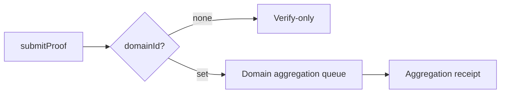
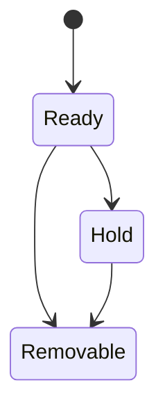

Domain is the first “routing gate” after proof submission. You do not need to treat it as an abstract concept, but you must know its exact place in the system: **if you submit a proof with a domainId, the system routes it to the corresponding aggregation queue; without a domainId, it does not enter aggregation**. This behavior determines whether a receipt appears and whether an on-chain-usable result exists.

Think of a domain as an “inbox”: you deliver proofs into an inbox, and its rules decide whether it can be aggregated, when it is aggregated, and who publishes the aggregation result. Different inboxes have different capacities and rules, and those rules directly affect your cost and availability.



**Where Domain appears**
You will see domainId explicitly in two kinds of interfaces: Kurier/zkVerifyJS/PolkadotJS `submitProof` calls all ask you to provide domainId. It is not just an “optional field,” but a key parameter that decides whether the proof enters aggregation. After verification, the system checks the domain; if no domainId is provided, it performs no aggregation actions.

**Engineering problems Domain solves**
The core value of a domain is fixing the “aggregation context.” It lets proofs enter different aggregation queues by target chain or strategy. In engineering, you will encounter problems like:

- A single system has multiple consumption targets (different chains, different contracts), and you need to split proofs by target.
- Different targets have different aggregation size and cost requirements, so you need different aggregation sizes and publication strategies.
- You do not want all proofs mixed in one aggregation, because that would make cost and publication strategies uncontrolled.

Domain provides “isolation and routing” at this point. It is not a decorative feature, but a prerequisite for controllable aggregation.

**Domain hard constraints (do not ignore)**
You cannot just fill in an arbitrary number as a domain. The system checks the domain and emits `CannotAggregate` when it cannot aggregate. Common reasons include: the domain does not exist, the domain state does not allow new proofs, the domain queue is full, the account balance is insufficient, or the submitter is not on the allowlist.

These errors do not make `submitProof` fail directly; they result in “verification passed but cannot enter aggregation.” If you do not listen for `CannotAggregate`, you will assume the proof entered aggregation. In engineering, this is a very typical source of misjudgment.

**Domain capacity and cost**
Each domain has its own `aggregation_size` and `queue_size`. `aggregation_size` determines how many proofs fit in a single aggregation, while `queue_size` determines how many pending aggregations can queue up. They affect system capacity and directly impact your publication and consumption costs.

From a cost perspective, domains also require storage deposits and balance requirements: registering a domain requires a deposit, and normal users can only register `Destination::None` domains; only a Manager can register a domain with a destination. This means “who can create domains” is a permission boundary, not an engineering detail.

**Domain lifecycle and state machine**
Domains have a state machine: Ready, Hold, Removable. Only the domain owner can call `holdDomain` to move a domain to Hold or Removable. After entering these states, the domain no longer accepts new proofs and cannot return to Ready. The engineering consequence is: if you put a domain on Hold, it becomes an inbox that stops receiving, and the system will not restore it for you.



**When is Domain “required”**
Strictly speaking, whether a domain is “required” depends on whether you need aggregation. The system behavior is: no domainId, no aggregation; with a domainId, it enters the aggregation queue. In other words, if your consumer needs a receipt (on-chain consumption), you must choose a usable domain; if you only do verify-only, you can omit domainId.

**When is Domain “optional”**
When you only need the `ProofVerified` result and do not need the receipt or Merkle path, domainId can be omitted. After verification, the system “does nothing” and does not enter the aggregation queue. This “doing nothing” is not a bug; it is the design of verify-only.

**Minimal input sketch**
Here are the structural differences for the two submission forms to help you branch in code:

```text
// verify-only
submitProof({ proof, vk, publicInputs })

// verify + aggregate
submitProof({ proof, vk, publicInputs, domainId })
```

**Common misconceptions and pitfalls**
The most common misconception is: as long as a proof passes verification, it will enter aggregation. In reality, verification and aggregation are two stages. Aggregation needs a domain and must satisfy the domain’s state and capacity constraints. Ignoring this leads you to expect a receipt that never appears because the proof never entered the aggregation queue.

> ⚠️ Warning: `CannotAggregate` is not a verification failure; it is an “aggregation failure.” If you treat it as a verification failure, you will misdiagnose the root cause.

> 💡 Tip: If you plan to do on-chain consumption, first confirm the domain exists and is in Ready, then submit the proof. Do not wait until there is no receipt to look for the cause.

To close the section, remember one engineering rule: **domain is the entry point for aggregation, not the entry point for verification**. You only need to care about domain when you need a receipt; otherwise it is just an extra failure point. The next section explains the aggregation flow so you can see how receipts are generated and published.
