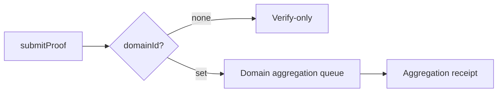
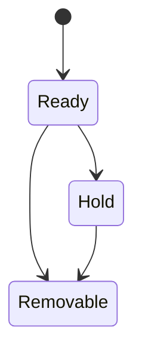

Domain 是 proof 提交之后的第一道“分流闸口”。你不需要把它理解成一个抽象概念，但必须知道它在系统里出现的准确位置：**proof 提交时带上 domainId，系统就把 proof 路由到对应的聚合队列；不带 domainId，则不进入聚合**。这个行为决定了后续会不会出现 receipt、会不会有链上可用的结果。

把 domain 想成“收件箱”会比较直观：你把 proof 投递到某个收件箱里，箱子的规则决定它能不能被聚合、何时被聚合、由谁来发布聚合结果。不同收件箱有不同容量与规则，这些规则直接影响你的成本和可用性。



**Domain 出现在哪里**
你会在两类接口里明确看到 domainId：Kurier/zkVerifyJS/PolkadotJS 的 `submitProof` 调用里都要求你输入 domainId。它不是“可选填项”那么简单，而是决定 proof 后续是否进入聚合的关键参数。系统在验证之后会检查 domain，如果 domainId 不提供，就不会做任何聚合动作。

**Domain 解决的工程问题**
Domain 的核心价值是把“聚合上下文”固定下来。它让 proof 按照不同目标链或不同策略进入不同的聚合队列。工程上你会遇到这些问题：

- 同一个系统里有多种消费目标（不同链、不同合约），你需要把 proof 按目标划分。
- 不同目标对聚合规模和成本有不同要求，你需要不同的聚合大小和发布策略。
- 你不希望所有 proof 混在一个聚合里，因为那会让成本和发布策略失控。

Domain 就是在这个位置提供“隔离和路由”的能力，它不是功能性装饰，而是让聚合可控的前提。

**Domain 的硬约束（不要忽略）**
Domain 不是你随便填一个数字就可以用的。系统会对 domain 做检查，并在不能聚合时发出 `CannotAggregate` 事件。常见原因包括：domain 不存在、domain 状态不允许新 proof、domain 队列已满、账户余额不足、或者提交者不在允许列表。

这些错误不会让 `submitProof` 直接失败，而是让它“验证通过但无法进入聚合”。如果你不监听 `CannotAggregate`，会误以为 proof 已进入聚合。工程上这是非常典型的误判来源。

**Domain 的容量与成本**
每个 domain 都有自己的 `aggregation_size` 和 `queue_size`。`aggregation_size` 决定一条聚合里最多容纳多少条 proof，`queue_size` 决定聚合队列里能堆多少条待发布聚合。它们不仅影响系统容量，也直接影响你在发布和消费时的成本。

从成本角度看，domain 还会触发存储押金与持币要求：注册 domain 需要押金，且普通用户只能注册 `Destination::None` 的 domain，只有 Manager 才能注册带目的地的 domain。这意味着“谁能创建 domain”是一条权限边界，不是工程细节。

**Domain 的生命周期与状态机**
Domain 有状态机：Ready、Hold、Removable。只有 domain owner 能调用 `holdDomain` 把 domain 放到 Hold 或 Removable。进入这些状态后，domain 将不再接受新 proof，并且无法回到 Ready。工程后果是：如果你把 domain 挂到 Hold，它就是一个“停止接收”的收件箱，系统不会帮你恢复。



**Domain 何时是“必须的”**
严格来说，domain 是否“必须”，取决于你是否需要聚合。系统行为是：没有 domainId 就不聚合；有 domainId 就进入聚合队列。也就是说，如果你的消费端需要 receipt（链上消费），你必须选择一个可用的 domain；如果你只做 verify-only，就可以不带 domainId。

**Domain 何时是“可选的”**
当你只需要 `ProofVerified` 结果，不需要 receipt 和 Merkle path 时，domainId 就可以不传。系统会在验证后“什么都不做”，不会进入聚合队列。这个“什么都不做”不是 bug，而是 verify-only 的设计。

**最小输入示意**
下面是两种提交形态的结构差异，帮助你在代码里做分支：

```text
// verify-only
submitProof({ proof, vk, publicInputs })

// verify + aggregate
submitProof({ proof, vk, publicInputs, domainId })
```

**常见误解与坑**
最常见的误解是：只要 proof 通过验证，就一定会进入聚合。实际情况是：验证和聚合是两个阶段，聚合需要 domain 且需要满足 domain 的状态和容量条件。忽略这一点的后果是：你以为 receipt 会出现，但实际上根本没进入聚合队列。

> ⚠️ Warning: `CannotAggregate` 不是验证失败，它是“聚合失败”。如果你把它当作验证失败，会误判问题根因。

> 💡 Tip: 如果你打算做链上消费，先确认 domain 存在且处于 Ready，再提交 proof。不要等到发现没有 receipt 才回头找原因。

为了收住这一节，记住一条工程规则：**domain 是聚合的入口，不是验证的入口**。你只有在需要 receipt 时才需要关心 domain；否则它只是多一个失败点。下一节会把聚合流程讲清楚，让你看到 receipt 是怎么被生成和发布的。
