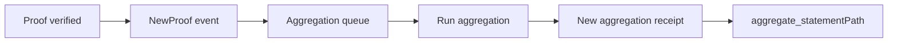

This section explains “what the aggregation engine does, and when you must use it.” If you only do verify-only, you can almost skip this page; but as soon as you want to deliver results to on-chain contracts, it becomes the main path.

Think of aggregation as “batch acceptance.” A proof passing verification does not mean a contract can trust it directly; the contract needs a verifiable “receipt.” The aggregation engine outputs that receipt: the receipt (Merkle root) plus the proof of your proof’s position in the tree. This combination lets the contract verify one root instead of N proofs.

First, its place in the flow: after a proof is submitted and verified, if it includes a domainId, it is placed into the corresponding aggregation queue. When added, it triggers `NewProof{statement, domainId, aggregationId}`. This is the signal for “which aggregation batch you entered.”

When an aggregation completes, any user can call `aggregate(domainId, aggregationId)` to generate a receipt. On success it emits `NewAggregationReceipt{domainId, aggregationId, receipt}`. Note: the block hash where this event appears is critical, because later Merkle path computation must use the same block.



The aggregation output can be split into three layers:

1) **receipt (Merkle root)**: the root for a batch of proofs; the contract verifies only this.
2) **aggregationId / domainId**: marks which aggregation batch you belong to.
3) **Merkle path**: proves your statement is in this tree.

With Kurier, you get `aggregationDetails` when `job-status` reaches `Aggregated`. It includes receipt, root, leaf, leafIndex, numberOfLeaves, and merkleProof. This payload is the direct input for contract verification.

```ts
if (jobStatusResponse.data.status === "Aggregated") {
  fs.writeFileSync(
    "aggregation.json",
    JSON.stringify({
      ...jobStatusResponse.data.aggregationDetails,
      aggregationId: jobStatusResponse.data.aggregationId
    })
  )
}
```

If you use the on-chain interface, you need to listen for `NewAggregationReceipt` yourself and record the block hash, then use the `aggregate_statementPath` RPC to get the Merkle path. Note that Published storage is only valid in the block where the receipt was created; if you miss the block hash, you cannot retrieve the path.

```text
path = aggregate_statementPath(blockHash, domainId, aggregationId, statement)
```

Aggregation is not “automatically done for you.” It is permissionless: anyone can publish an aggregation and claim the corresponding fees. This is why aggregation events are not triggered only by a “system service,” but can be triggered by any participant. You cannot assume “some fixed service will definitely publish.”

You also need to understand the boundaries of aggregation failure: `aggregate` can fail if the domain does not exist, the aggregationId is invalid, or it has already been published. On failure the publisher only pays a fail-fast cost, but your proof does not disappear. Engineering-wise, you need to handle “waiting for the next successful aggregation publication.”

> ⚠️ Warning: You must record the block hash of `NewAggregationReceipt`, or you will not be able to compute the Merkle path later.

> 💡 Tip: If contract-side verification fails, first check that the Merkle path comes from the correct receipt block. This mistake is more common than a contract logic bug.

Treat the aggregation engine as a “receipt generator.” It will not consume results for you; it only packages verified proofs into an on-chain verifiable form. The next section covers Relay vs Mainchain APIs so you know which interface path to use.
