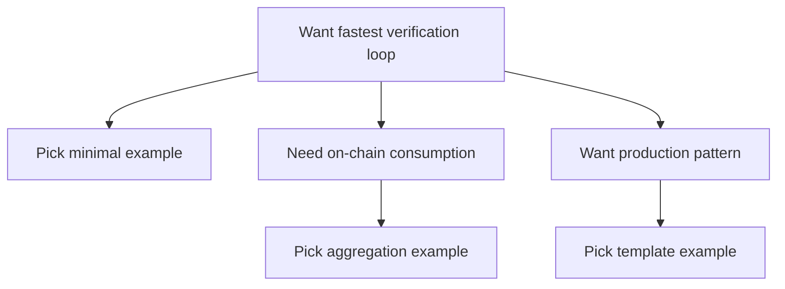

If your goal is simple—“give me an example that runs”—this path is for you. Many engineers are not unwilling to learn concepts, they just lack a starting point to validate their approach: run a working sample first, confirm the pipeline, then expand into more complex scenarios. This chapter is positioned as “runnable + modifiable,” not “theory.”

Think of this section like a cookbook: you do not need to be a chef first. Prepare the ingredients, follow the steps, and you see results. After you get it running, going back to understand “why the ratio is set this way” is much more efficient. The value here is not to turn you into a ZK expert, but to help you build engineering confidence quickly.

The examples in this chapter are not random. They follow the sequence “minimal verifiable → reusable template → production patterns.” You can treat it as a progressive scaffold: start with the simplest proof submission and gradually see more engineering boundaries—how inputs are organized, how results are consumed, when aggregation is needed, and when it is not.

To avoid “copying without understanding,” each example should answer a few engineering questions: what am I proving? Which inputs are public, and which must remain private? Who consumes the verification result? These are the intent of the examples, not the form. You do not need to memorize terminology—if you can align “purpose → input → output,” the example is good.

If you come from a Web2 background, you may be used to a “request → response” verification model; if you have on-chain experience, you may care more about “event → proof → contract consumption.” This chapter puts these two mindsets in the same example so you see they are two ends of the same line, not two different systems.

Before you run examples, set one expectation: you will encounter different proof-system toolchains, and their interfaces and artifacts differ. That does not mean you chose the wrong one; it is a system-level difference. zkVerify supports multiple proof systems, so examples cover different toolchains. Your goal is not to memorize them all, but to find one starting point you can run reliably.

Here is a minimal “example selection” path to help you decide where to start:



If you are not sure where to begin, use this order: run the minimal example first and confirm verification events appear; then run an aggregation example and confirm you can obtain a receipt; finally look at the production template to learn how to wire results back into business logic. This order is not mandatory, but it reduces pitfalls.

This chapter also emphasizes “reusable” design: do not treat the examples as one-off demos, but as a reusable skeleton. You can move core inputs, outputs, and event-listening logic into your project rather than rebuilding the wheel from scratch.

```text
Example skeleton:
1) Prepare inputs
2) Generate proof
3) Submit proof
4) Observe verification result
5) Consume result
```

> 💡 Tip: Add logging and event listeners first. Many “it does not run” issues are not proof errors, but that you never saw the verification events.

> ⚠️ Warning: Do not treat examples as “production defaults.” Examples explain structure and paths, not your business boundaries.

To avoid running an example and still not knowing what to do next, each example will state what problem it solves, what cost it saves, and which boundaries remain unresolved. Note those boundaries, and you will know where you need to fill in the gaps.

If you already have business logic running, start with the example closest to your goal, then adjust inputs and consumption backward. This is faster than starting a new example from scratch, and it helps avoid “the function runs but the semantics are wrong.”

Finally, the most practical point: this chapter aims to get you “running,” not to make you “fully understand.” After you run your first example, go back to the concept pages and you will find them suddenly readable. The next section introduces the minimal example list, so you can pick one and start.
