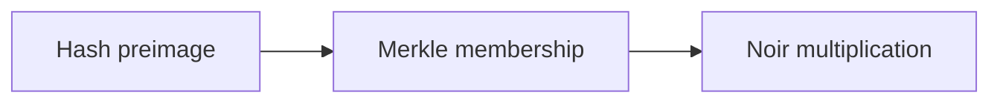

This page gives three “minimal runnable” examples. It does not chase fancy features; it only targets **a visible verification loop**. Once you run them, you will know the roles of proofs, public inputs, verification events, and (when needed) aggregation results in an engineering context. Each example is deliberately scoped so you can see results within 10–20 minutes.

To avoid “it runs but I do not understand,” each example answers the same engineering questions:

1) What exactly am I proving?
2) Which inputs are public, and which must stay private?
3) Is the result consumed in the application, or does it need aggregation?

Think of them as a “minimal reusable scaffold.” Extract the core inputs and outputs, then swap in your own business data.

Below is a quick overview table to help you choose where to start.

| Example | What is proven | Public inputs | Private inputs | Best for |
| --- | --- | --- | --- | --- |
| Hash preimage | “I know the preimage of a hash” | Hash value | Preimage | Quick verification loop and hash circuit |
| Merkle membership | “I am in this tree” | Merkle root | Leaf + path | Membership/eligibility proofs |
| Noir multiplication | “The product of two numbers is correct” | Product | Factors | Minimal arithmetic circuit |

> 💡 Tip: If you only want to confirm zkVerify’s verification loop, run Hash preimage first. Its structure is simplest and easiest to debug.

## Example 1: Hash preimage

**Proof statement**: I know the preimage of a hash value. Engineering-wise, it solves “I can prove I know a secret without revealing the secret itself.”

**Input split**:
- Public input: `hash` (visible to the verifier)
- Private input: `secret` (kept by the prover)

Think of it as “lock verification”: the verifier only sees the lock’s number, while the private input is the key itself. If the key opens the lock, you prove you know the preimage.

```text
hash = Hash(secret)
assert hash == public_hash
```

**Why this example matters**: it is the minimal verification loop. If you can submit the proof to zkVerify and see the verification event, you confirm that “proof + public inputs + vk” is wired correctly.

**Where you will trip**:
- The hash function you use does not match the circuit.
- Public input serialization does not match the circuit’s expectation.

> ⚠️ Warning: Do not submit `secret` as a public input. That reveals what you want to hide and defeats the proof.

**Aggregation needed**: no. This example is about the verification loop and privacy boundaries, not on-chain consumption.

## Example 2: Merkle membership (basic)

**Proof statement**: I am on a list. Engineering-wise, it solves “I can prove membership in a set without revealing the set itself.”

**Input split**:
- Public input: `root`
- Private inputs: `leaf`, `pathElements[]`, `pathIndices[]`

Think of it as a “membership receipt”: the root is the set digest, and the path is your route from leaf to root. The verifier only needs the root and your path to verify membership.

```text
cur = leaf
for i in 0..depth-1:
  if pathIndices[i] == 0:
    cur = Hash(cur, pathElements[i])
  else:
    cur = Hash(pathElements[i], cur)
assert cur == root
```

**Why this example matters**: it introduces “batch proof” intuition. You will see for the first time that “I do not need to reveal the whole set; I only reveal the root,” which is foundational for later aggregation and on-chain consumption.

**Where you will trip**:
- `pathIndices` direction is reversed, which breaks the path.
- The root comes from a different tree or different leaf ordering.

> 💡 Tip: Wrong path direction is the most common bug. Print `cur` at each level and see where it starts diverging.

**Aggregation needed**: it depends on the consumer. If you need on-chain contract consumption, you will need aggregation; if it is application-side verification only, verify-only is enough.

## Example 3: Noir multiplication circuit

**Proof statement**: the product of two numbers is correct. Engineering-wise, it is the “minimal arithmetic circuit example,” suitable for validating your toolchain.

**Input split**:
- Public input: `product`
- Private inputs: `a`, `b`

It is slightly more complex than the hash example but still very small, making it suitable for validating the full “circuit → proof → verification” toolchain.

```text
assert a * b == product
```

**Why this example matters**: it lets you see the structure of an “arithmetic circuit” for the first time, rather than pure hash or set proofs. You will start to realize that a circuit is essentially a constraint system, and a proof is evidence that the constraints are satisfied.

**Where you will trip**:
- Public and private inputs are ordered inconsistently.
- The circuit field order does not match the proving toolchain export order.

> ⚠️ Warning: Wrong ordering looks like “proof always fails,” but the issue is input mapping.

## Suggested run order

If this is your first time with ZK, run them in this order:

1) Hash preimage → validate the “minimal loop.”
2) Merkle membership → validate “set proof intuition.”
3) Noir multiplication → validate “arithmetic circuit path.”

This adds only one complexity dimension at each step, instead of jumping into a complex circuit all at once.



## A reusable minimal skeleton

No matter which example you use, the verification loop skeleton is the same:

```text
1) Prepare inputs (public + private)
2) Generate proof (off-chain)
3) Submit proof to zkVerify
4) Observe verification result
5) Consume result (app or contract)
```

These five steps are not for “writing a process,” but to keep you from getting stuck in steps 3/4 without knowing where to look.

## Common misconceptions and debugging mindset

**Misconception 1: proof failure is always a chain problem.**
In reality, most failures come from input misalignment: public inputs do not match, vk versions differ, or the path direction is wrong.

**Misconception 2: if the example runs, it is production-ready.**
Examples only solve “structure,” not “scale, cost, or permission boundaries.” After running them, you still need to decide whether to aggregate, whether you need a domain, and whether you need on-chain consumption.

**Misconception 3: verification success means the business is done.**
Verification only means “the fact is true.” The business still has to decide how to use that fact—granting permissions, recording audits, triggering contract calls. None of that is in the examples.

> 💡 Tip: When debugging, print the inputs into a “readable structure” before looking at proofs/verification. Often the issue is not the algorithm, but input ordering or encoding.

The core of this page is not for you to memorize three examples, but to give you a “minimal runnable” starting point. After you run them, the next section provides production-style examples that extend the minimal skeleton into real scenarios.
