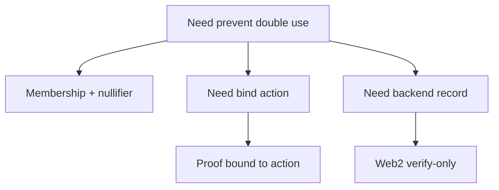

The three examples in this section are not “run and done.” They put real engineering problems into executable structures. Their common theme: you must handle **state reuse, replay attacks, and result persistence**. If you have only done minimal examples, this is the step that upgrades you from “demo-grade” to “ship-ready.”

The three examples each solve a real-world problem:

- **Membership + nullifier**: prevent the same credential from being reused.
- **Proof bound to action**: prevent a proof from being replayed for a different action.
- **Web2 verify-only template**: persist verification results in backend storage for permissions and auditing.

To make the structure clear, each example follows “goal → input structure → key logic → verification landing.” You can move these skeletons directly into your project and replace them with your own business fields.

---

## Example 1: Membership + nullifier (prevent reuse)

**Engineering goal**: the same credential can only be used once. Typical scenarios include airdrop claims, single-use voting, and one-time coupons. You allow users to prove “I am on the list,” but you do not allow repeated submissions with the same identity.

**Key idea**: the proof shows membership; the nullifier provides “uniqueness.” The nullifier is derived from a private identity + scenario domain + random salt, but it is public. After verification, you record the nullifier; if it appears again, you reject it.

**Input structure (illustrative)**:

```text
publicInputs = { root, nullifier }
privateInputs = { leaf, pathElements[], pathIndices[], secret }
```

**Minimal circuit logic (pseudocode)**:

```text
assert MerklePath(leaf, pathElements, pathIndices) == root
nullifier = Hash(secret, domain, salt)
assert nullifier == public_nullifier
```

**Verification landing (Web2 / on-chain)**:

```ts
// server-side pseudo logic
if (db.nullifiers.has(nullifier)) {
  throw new Error("Already used")
}
db.nullifiers.add(nullifier)
```

**Common pitfall**:
Treating the nullifier as private input and not writing it to public inputs. The verifier then cannot detect reuse, meaning the system has no replay protection.

> 💡 Tip: A nullifier is essentially a “public one-time identifier,” and it only works if it is in public inputs.

---

## Example 2: Proof bound to action (anti-replay)

**Engineering goal**: the same proof cannot be used to trigger a different action. For example, you prove “I can claim A,” but someone else uses the proof to request B.

**Key idea**: write action metadata into public inputs so the proof is bound to a specific action. The action can be an endpoint, contract method, parameter digest, or even a time window.

**Input structure (illustrative)**:

```text
publicInputs = { root, actionHash }
privateInputs = { leaf, pathElements[], pathIndices[], secret }
```

**Action binding logic (illustrative)**:

```ts
const action = {
  method: "claim",
  paramsHash: hash(params),
  expiry: "2026-01-31"
}
const actionHash = hash(action)
// actionHash must match publicInputs
```

**Verification landing**:
After verification, you must confirm the current request’s `actionHash` matches the `actionHash` in the proof, or reject the action. Otherwise the proof can be replayed in a different context.

**Common pitfall**:
Storing the action only in the application layer and not in the proof. The proof becomes a “generic pass” and loses action binding.

> ⚠️ Warning: If a proof is not bound to an action, it is a replayable credential that anyone can reuse.

---

## Example 3: Web2 verify-only template (persist results)

**Engineering goal**: persist verification results to the backend to form stable “verification records.” You do not need on-chain consumption, but you need auditing, retries, or access control.

**Key idea**: after receiving the `ProofVerified` event or job-status result, persist the statement and business context. On the next request, check the record first instead of verifying again.

**Record structure (illustrative)**:

```ts
type VerificationRecord = {
  statement: string
  userId: string
  action: string
  createdAt: string
  status: "verified" | "failed"
}
```

**Minimal handling flow**:

```ts
if (event.type === "ProofVerified") {
  await db.verifications.insert({
    statement: event.statement,
    userId,
    action,
    createdAt: new Date().toISOString(),
    status: "verified"
  })
}
```

**Common pitfall**:
Storing only “verified/failed” as a boolean and not the statement. Then you cannot link to a specific proof, and audits become untraceable.

> 💡 Tip: The statement is the unique fingerprint of a verification result. Use it as the audit index.

---

## Which should you build first?

If your product needs “single-use credentials,” start with nullifier. If you worry about proofs being copied to other actions, start with action binding. If you just want to launch a verification loop quickly, start with verify-only records.



## Final reminder

These examples solve “real system pitfalls,” not “does it run.” After you finish, you should be clear on three things:

1) Whether your proof binds uniqueness or action semantics.
2) Whether your verification results can be audited and reused.
3) Whether your consumption logic distinguishes “verification success” from “business complete.”

If you can answer these three questions, you have moved from “demo-grade” to “ship-ready.” The next section provides a unified example template to help you migrate these patterns into new use cases.
