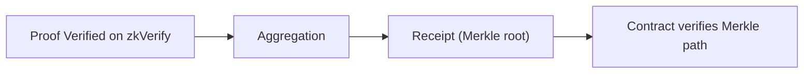

This path solves one question: **when verification results must enter a contract, what on-chain materials do you need?** Many engineering issues are not “is the proof correct,” but “can the contract verify it.” If you ignore aggregation and receipts, you will get stuck in on-chain consumption.

You need to accept a reality: contracts will not re-verify a full proof. They consume the aggregated receipt (Merkle root) and your Merkle path. In other words, **zkVerify verifies the proof; the contract verifies “you are in the receipt.”** This boundary means you must use the verify + aggregate path.

You can view the process as a “customs receipt.” zkVerify gives you a receipt, and the contract only checks that receipt. Without a receipt, even a valid proof will not be trusted by the contract.

This chapter splits the “contract consumption” path into two parts:

- **With a contract**: you need receipt, aggregationId, domainId, and Merkle path, and you verify them in the contract.
- **Without a contract**: you only need the verification event or job-status result, and consume on the Web2 side.

If you do cross-chain or multi-contract consumption, aggregation is not an “optional optimization,” but a “required path.” The receipt is the minimal unit of on-chain trust; it lets the contract verify one root instead of N proofs.

You will face two engineering questions in this chapter:

1) How do I get the receipt and Merkle path?
2) How does the contract verify I am in the receipt?

These two questions run through every page that follows. If you remember only one sentence: **on-chain consumption requires a receipt, not a proof**.

> ⚠️ Warning: Submitting a proof alone will not produce a contract-usable result. Without a receipt, the contract cannot verify that your proof was accepted by zkVerify.

> 💡 Tip: If you only consume on the Web2 side, do not introduce the contract flow yet. Verify-only gets you live faster, then you can decide whether to enter aggregation.

This section is the entry to the contract consumption path. The next section starts with “I have a contract” and walks the end-to-end flow, before covering “how to consume without a contract.”
