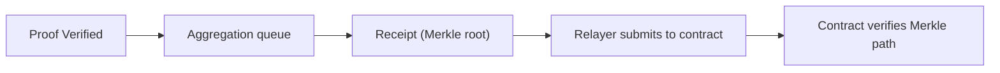
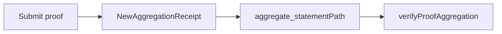

This section is for readers who already have a contract. You are not asking whether a proof was generated, but **how the contract decides the verification result is trustworthy**. The answer is direct: the contract does not verify proofs; it verifies the receipt (Merkle root) and your Merkle path. This path means you must use verify + aggregate.

Think of zkVerify as an “acceptance center,” and the contract only recognizes the “acceptance receipt.” After a proof is verified on zkVerify, it is aggregated into a receipt. Once the receipt is published to the target-chain contract, you use a Merkle path to prove “my proof is included in this receipt batch.”

The diagram below shows the end-to-end structure, focusing on how data moves from zkVerify to the contract:



## 1) How the receipt reaches the contract

zkVerify generates a receipt when aggregation completes, and a relayer publishes it to the zkVerify contract on the target chain. Inside the contract, an internal mapping records aggregation results:

```solidity
mapping(uint256 => mapping(uint256 => bytes32)) public proofsAggregations;
```

The publishing entry points are `submitAggregation` or `submitAggregationBatchByDomainId`. The former submits a single aggregation; the latter submits in batches to save gas:

```solidity
function submitAggregation(
    uint256 _domainId,
    uint256 _aggregationId,
    bytes32 _proofsAggregation
) external onlyRole(OPERATOR);

function submitAggregationBatchByDomainId(
    uint256 _domainId,
    uint256[] calldata _aggregationIds,
    bytes32[] calldata _proofsAggregations
) external onlyRole(OPERATOR);
```

If you are a contract consumer, you do not call these functions manually, but you must understand “how the receipt is written into the contract.” Otherwise, you cannot explain why the contract lacks the root you expect.

## 2) How do I get the Merkle path

After a proof is aggregated, you need its position in the tree. You can get it through events and RPC:

- Listen for the `NewAggregationReceipt` event and record `domainId`, `aggregationId`, and the **event’s block hash**.
- Use the `aggregate_statementPath` RPC with the block hash, domainId, aggregationId, and statement to retrieve the Merkle path.

The most overlooked part is the block hash. Published storage only exists in the block where the receipt is created; if you miss it, you cannot retrieve the path.

```text
path = aggregate_statementPath(blockHash, domainId, aggregationId, statement)
```

## 3) How the contract verifies inclusion

The contract verification entry is `verifyProofAggregation`. It checks that the aggregation exists and verifies your leaf with the Merkle path:

```solidity
function verifyProofAggregation(
    uint256 _domainId,
    uint256 _aggregationId,
    bytes32 _leaf,
    bytes32[] calldata _merklePath,
    uint256 _leafCount,
    uint256 _index
) external view returns (bool);
```

Its core logic is Merkle verification against the root:

```solidity
return Merkle.verifyProofKeccak(
  proofsAggregation,
  _merklePath,
  _leafCount,
  _index,
  _leaf
);
```

The key inputs you provide include aggregationId, domainId, leaf, Merkle path, leafIndex, and numberOfLeaves. Most of these come from aggregation results or aggregationDetails. Only the hash of public inputs must come from the proof generation side.

```text
inputs = { domainId, aggregationId, leaf, merklePath, leafIndex, numberOfLeaves }
```

## 4) A minimal “contract consumption” call path

1) Submit the proof and enter the aggregation queue.
2) Listen for `NewAggregationReceipt` and record the block hash.
3) Use `aggregate_statementPath` to obtain the Merkle path.
4) Assemble the leaf and path, then call `verifyProofAggregation`.



> ⚠️ Warning: If you do not record the block hash of the receipt event, you cannot compute the Merkle path later.

> 💡 Tip: If contract verification fails, first check whether leafIndex/numberOfLeaves align with the receipt; wrong ordering fails immediately.

The key point to remember: **the contract consumes receipt + Merkle path, not the proof itself**. The next section covers how to consume results without a contract; in early stages you can use that path before returning here for on-chain integration.
