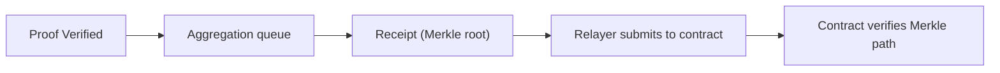
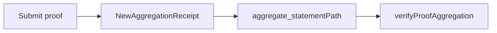

这一节写给“已经有合约”的人。你关心的不是 proof 有没有生成，而是**合约到底如何判断验证结果可信**。答案很直接：合约不验证 proof，合约验证 receipt（Merkle root）和你的 Merkle path。这条路径决定了你必须走 verify + aggregate。

可以把 zkVerify 当成“验收中心”，而合约只认“验收单”。proof 在 zkVerify 上通过验证后，会被聚合成 receipt。receipt 发布到目标链合约后，你再用 Merkle path 证明“我的 proof 被包含在这批验收单里”。

下面这张图给你一个端到端结构，重点是数据如何从 zkVerify 到合约：



## 1) receipt 如何到达合约

zkVerify 在聚合完成时生成 receipt，并由 relayer 发布到目标链的 zkVerify 合约。合约内部用一个映射记录聚合结果：

```solidity
mapping(uint256 => mapping(uint256 => bytes32)) public proofsAggregations;
```

发布入口是 `submitAggregation` 或 `submitAggregationBatchByDomainId`。前者提交单条聚合，后者批量提交，节省 gas：

```solidity
function submitAggregation(
    uint256 _domainId,
    uint256 _aggregationId,
    bytes32 _proofsAggregation
) external onlyRole(OPERATOR);

function submitAggregationBatchByDomainId(
    uint256 _domainId,
    uint256[] calldata _aggregationIds,
    bytes32[] calldata _proofsAggregations
) external onlyRole(OPERATOR);
```

如果你是合约使用方，你不用手动调用这些函数，但你必须理解“receipt 以什么格式写入合约”。否则你无法解释为什么合约里没有你想要的 root。

## 2) 我如何拿到 Merkle path

proof 被聚合后，你需要拿到它在这棵树里的位置。你可以通过事件与 RPC 拿到：

- 监听 `NewAggregationReceipt` 事件，记录 `domainId`、`aggregationId` 和**事件所在 block hash**。
- 使用 `aggregate_statementPath` RPC 根据 block hash、domainId、aggregationId 和 statement 取回 Merkle path。

这一步最容易被忽略的是 block hash。Published storage 只在 receipt 生成的那个 block 存在，如果你错过它，就拿不到路径。

```text
path = aggregate_statementPath(blockHash, domainId, aggregationId, statement)
```

## 3) 合约如何验证包含关系

合约验证的入口是 `verifyProofAggregation`。它会检查 aggregation 是否存在，并用 Merkle path 验证你的 leaf：

```solidity
function verifyProofAggregation(
    uint256 _domainId,
    uint256 _aggregationId,
    bytes32 _leaf,
    bytes32[] calldata _merklePath,
    uint256 _leafCount,
    uint256 _index
) external view returns (bool);
```

它的核心逻辑是对 root 做 Merkle 验证：

```solidity
return Merkle.verifyProofKeccak(
  proofsAggregation,
  _merklePath,
  _leafCount,
  _index,
  _leaf
);
```

你要提供的关键输入包括：aggregationId、domainId、leaf、Merkle path、leafIndex 和 numberOfLeaves。这些字段绝大部分来自聚合结果或 aggregationDetails。只有 public inputs 的 hash 需要你从 proof 生成侧拿到。

```text
inputs = { domainId, aggregationId, leaf, merklePath, leafIndex, numberOfLeaves }
```

## 4) 一个最小的“合约消费”调用路径

1) 提交 proof 并进入聚合队列。
2) 监听 `NewAggregationReceipt`，记录 block hash。
3) 使用 `aggregate_statementPath` 拿到 Merkle path。
4) 组装 leaf 与路径，调用 `verifyProofAggregation`。



> ⚠️ Warning: 如果你不记录 receipt 事件所在的 block hash，后续无法计算 Merkle path。

> 💡 Tip: 合约验证失败时，先检查 leafIndex/numberOfLeaves 是否与 receipt 对应，顺序错了会直接失败。

这节要你记住的核心点是：**合约端消费的是 receipt + Merkle path，不是 proof 本身**。下一节会讲“没有合约时”如何消费验证结果，你可以在工程早期先走那条路径，再回到这里做链上落地。
