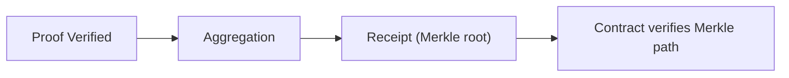

This section answers one question: **when is aggregation mandatory?** You can think of it as “does the contract require a receipt.” If the consumer is on-chain, the contract needs a receipt to verify, so you must aggregate; if the consumer is on the application side, you can stop at the verification event.

Start with mandatory scenarios: when your verification result must enter **another chain or contract**, aggregation is not an optimization; it is the only viable path. The reason is simple: contracts do not verify proofs directly; they only accept receipts (Merkle roots) and Merkle paths. Without a receipt, there is nothing a contract can verify.

An engineering analogy: aggregation “issues the acceptance receipt,” and the contract is the “gate that checks only receipts.” Without the receipt, the gate will not let you through.



Now the non-mandatory scenario: when verification results are consumed only in Web2 or internal systems, verify-only is enough. You only need the `ProofVerified` event or `Finalized` status as a business signal, without entering the receipt publication flow.

A common misunderstanding is “verification success means it is usable on-chain.” In reality, verification success is only the first step; on-chain consumption requires aggregation. If you treat verify-only as on-chain-ready, the contract side will keep failing.

Here is a minimal decision checklist to help you determine whether aggregation is required:

```text
if consumer_is_contract or cross_chain:
  aggregation_required = true
else:
  aggregation_required = false
```

> ⚠️ Warning: Do not treat “verification success” as “on-chain usable.” Contracts only accept receipt + Merkle path.

> 💡 Tip: If you are unsure whether the consumer will be on-chain, design for verify-only first; once you commit to on-chain consumption, switch to the aggregation path.

Close with one sentence: **aggregation is the ticket for on-chain consumption, not a performance optimization tool.** The next chapter covers common questions and troubleshooting to help with real-world integration issues.
