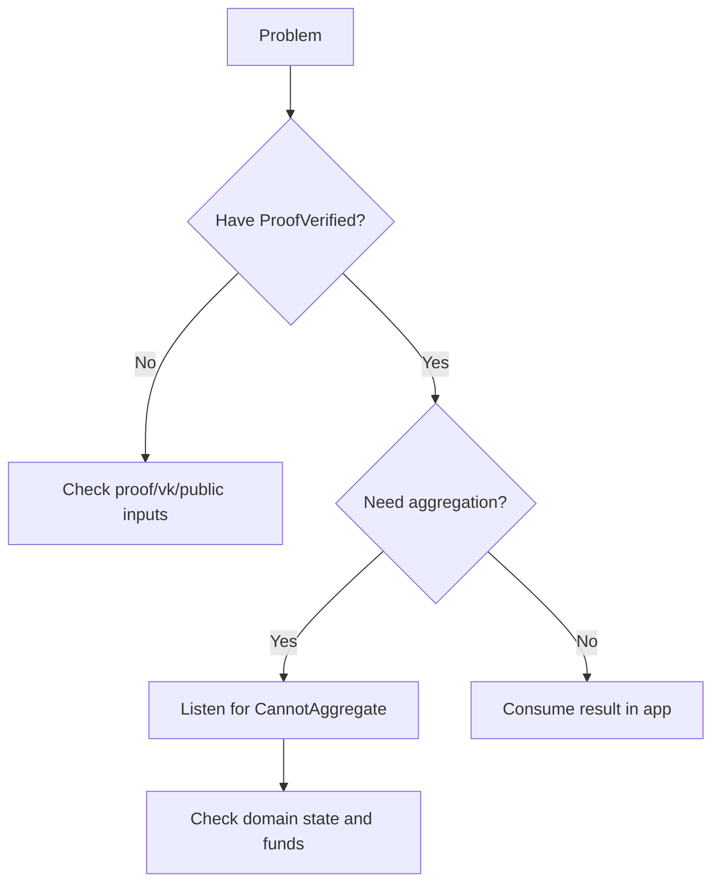

This page is a “debug guide,” not a concept review. Treat it as a troubleshooting flow: first locate which layer failed, then check the cause and fix. Most issues are not “the proving algorithm is wrong,” but event listening, domain state, or input version mismatches.

To make diagnosis easier, split issues into three categories:

1) **Verification failures**: the proof does not pass.
2) **Aggregation failures**: the proof passes, but does not enter aggregation or yields no receipt.
3) **On-chain interaction failures**: transactions, event listening, or RPC calls fail.

Below is the most common issue list in “symptom → cause → fix” form.

---

## 1) Verification failure: ProofVerified missing

**Symptom**: after submitting a proof, there is no `ProofVerified`, or the chain reports an error. The transaction is still included in a block, but fails.

**Cause**: the proof fails or inputs are misaligned. Failed transactions still go on-chain and cost fees to prevent DoS. If you retry blindly, you will pay repeatedly.

**Fix**:

- Go back to the proof generation side and confirm vk and proof come from the same compilation artifacts.
- Check that public input encoding and ordering match the circuit.
- If using Kurier, confirm proofType matches the vk type.

> ⚠️ Warning: Verification failures do not refund fees; failures still cost. Do not use “blind retries” instead of debugging.

---

## 2) Aggregation failure: verified but no receipt

**Symptom**: `ProofVerified` appears, but there is no `NewAggregationReceipt`, and you cannot get the Merkle path.

**Cause**: aggregation depends on the domain, and the domain may be rejected or unavailable. Common rejection is the `CannotAggregate` event.

**Fix**:

- Listen for `CannotAggregate` and check the reason.
- Check that the domainId exists and the domain is Ready.
- Check whether the domain queue is full, the submitter has enough balance, and is on the allow-list.

**Common rejection reasons**:

- `DomainNotRegistered{domainId}`
- `InvalidDomainState{domainId, state}`
- `DomainStorageFull{domainId}`
- `InsufficientFunds`
- `UnauthorizedUser`

> 💡 Tip: Aggregation failure is not verification failure. You must distinguish them or you will fix the wrong thing.

---

## 3) Merkle path retrieval failure

**Symptom**: `NewAggregationReceipt` appears, but `aggregate_statementPath` fails or returns empty.

**Cause**: Published storage only exists for one block. You must use the block hash of the receipt event, or path computation fails.

**Fix**:

- Record the block hash of `NewAggregationReceipt`.
- Call `aggregate_statementPath` with block hash + domainId + aggregationId + statement.

---

## 4) Kurier status stuck

**Symptom**: job-status stays at `Queued` or never progresses.

**Cause**: you did not include `chainId` on submission, so the status flow is never generated.

**Fix**:

- Ensure the `submit-proof` request includes `chainId`.
- Confirm the API key matches the network environment (mainnet/testnet).

---

## 5) Domain operations fail

**Symptom**: registering a domain or changing domain state fails.

**Cause**: insufficient permissions or deposits. Normal users can only register `Destination::None` domains and must pay a storage deposit.

**Fix**:

- Ensure the account has enough balance for the domain storage deposit.
- If you need a domain with a destination chain, confirm you have Manager permissions.

---

## A minimal troubleshooting flow

> 💡 Tip: First decide whether it is “verification failure” or “aggregation failure.” This reduces 80% of wasted debugging.

This page aims to help you classify issues quickly. The next section explains “how to use results after verification passes,” connecting troubleshooting to real business logic.
